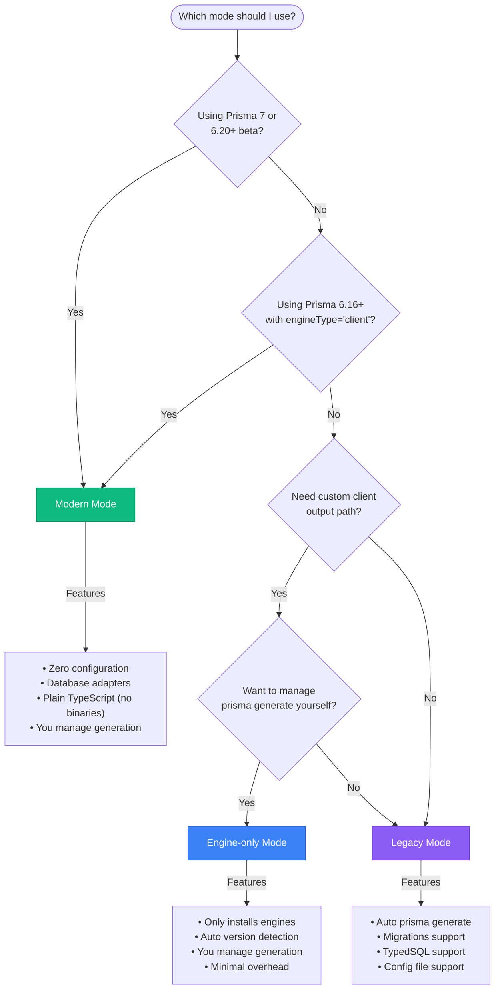

> Sources:
> - https://trigger.dev/docs/config/extensions/overview
> - https://trigger.dev/docs/config/extensions/prismaExtension
> - https://trigger.dev/docs/config/extensions/syncEnvVars
> - https://trigger.dev/docs/config/extensions/puppeteer
> - https://trigger.dev/docs/config/extensions/playwright
> - https://trigger.dev/docs/config/extensions/ffmpeg
> - https://trigger.dev/docs/config/extensions/aptGet
> - https://trigger.dev/docs/config/extensions/additionalFiles
> - https://trigger.dev/docs/config/extensions/additionalPackages
> - https://trigger.dev/docs/config/extensions/pythonExtension
> - https://trigger.dev/docs/config/extensions/esbuildPlugin
> - https://trigger.dev/docs/config/extensions/emitDecoratorMetadata
> - https://trigger.dev/docs/config/extensions/audioWaveform
> - https://trigger.dev/docs/config/extensions/lightpanda
> - https://trigger.dev/docs/config/extensions/custom

# Build Extensions

## Build extensions

Customize how your project is built and deployed to Trigger.dev with build extensions

Build extensions allow you to hook into the build system and customize the build process or the resulting bundle and container image (in the case of deploying).

You can use pre-built extensions by installing the `@trigger.dev/build` package into your `devDependencies`, or you can create your own.

Build extensions are added to your `trigger.config.ts` file under the `build.extensions` property:

```ts theme={"theme":"css-variables"}
import { defineConfig } from "@trigger.dev/sdk";

export default defineConfig({
  project: "my-project",
  build: {
    extensions: [
      {
        name: "my-extension",
        onBuildStart: async (context) => {
          console.log("Build starting!");
        },
      },
    ],
  },
});
```

If you are using a pre-built extension, you can import it from the `@trigger.dev/build` package:

```ts theme={"theme":"css-variables"}
import { defineConfig } from "@trigger.dev/sdk";
import { ffmpeg } from "@trigger.dev/build/extensions/core";

export default defineConfig({
  project: "my-project",
  build: {
    extensions: [ffmpeg()],
  },
});
```

## Built-in extensions

Trigger.dev provides a set of built-in extensions that you can use to customize how your project is built and deployed. These extensions are available out of the box and can be configured in your `trigger.config.ts` file.

| Extension                                                                 | Description                                                                    |
| :------------------------------------------------------------------------ | :----------------------------------------------------------------------------- |
| [prismaExtension](/config/extensions/prismaExtension)                     | Using prisma in your Trigger.dev tasks                                         |
| [pythonExtension](/config/extensions/pythonExtension)                     | Execute Python scripts in your project                                         |
| [puppeteer](/config/extensions/puppeteer)                                 | Use Puppeteer in your Trigger.dev tasks                                        |
| [ffmpeg](/config/extensions/ffmpeg)                                       | Use FFmpeg in your Trigger.dev tasks                                           |
| [aptGet](/config/extensions/aptGet)                                       | Install system packages in your build image                                    |
| [additionalFiles](/config/extensions/additionalFiles)                     | Copy additional files to your build image                                      |
| [additionalPackages](/config/extensions/additionalPackages)               | Install additional npm packages in your build image                            |
| [syncEnvVars](/config/extensions/syncEnvVars)                             | Automatically sync environment variables from external services to Trigger.dev |
| [syncVercelEnvVars](/config/extensions/syncEnvVars#syncVercelEnvVars)     | Automatically sync environment variables from Vercel to Trigger.dev            |
| [syncSupabaseEnvVars](/config/extensions/syncEnvVars#syncSupabaseEnvVars) | Automatically sync environment variables from Supabase to Trigger.dev          |
| [esbuildPlugin](/config/extensions/esbuildPlugin)                         | Add existing or custom esbuild extensions to customize your build process      |
| [emitDecoratorMetadata](/config/extensions/emitDecoratorMetadata)         | Enable `emitDecoratorMetadata` in your TypeScript build                        |
| [audioWaveform](/config/extensions/audioWaveform)                         | Add Audio Waveform to your build image                                         |

## Custom extensions

If one of the built-in extensions doesn't meet your needs, you can create your own custom extension. See our [guide on creating custom build extensions](/config/extensions/custom) for more information.

---

## Prisma

Use the prismaExtension build extension to use Prisma with Trigger.dev

The `prismaExtension` supports multiple Prisma versions and deployment strategies through **three distinct modes** that handle the evolving Prisma ecosystem, from legacy setups to Prisma 7.

<Note>
  The `prismaExtension` requires an explicit `mode` parameter. All configurations must specify a
  mode.
</Note>

## Migration from previous versions

### Before (pre 4.1.1)

```ts theme={"theme":"css-variables"}
import { prismaExtension } from "@trigger.dev/build/extensions/prisma";

extensions: [
  prismaExtension({
    schema: "prisma/schema.prisma",
    migrate: true,
    typedSql: true,
    directUrlEnvVarName: "DATABASE_URL_UNPOOLED",
  }),
];
```

### After (4.1.1+)

```ts theme={"theme":"css-variables"}
import { prismaExtension } from "@trigger.dev/build/extensions/prisma";

extensions: [
  prismaExtension({
    mode: "legacy", // MODE IS REQUIRED
    schema: "prisma/schema.prisma",
    migrate: true,
    typedSql: true,
    directUrlEnvVarName: "DATABASE_URL_UNPOOLED",
  }),
];
```

## Choosing the right mode

Use this decision tree to determine which mode is right for your project:



## Extension modes

### Legacy mode

**Use when:** You're using Prisma 6.x or earlier with the `prisma-client-js` provider.

**Features:**

* Automatic `prisma generate` during deployment
* Supports single-file schemas (`prisma/schema.prisma`)
* Supports multi-file schemas (Prisma 6.7+, directory-based schemas)
* Supports Prisma config files (`prisma.config.ts`) via `@prisma/config` package
* Migration support with `migrate: true`
* TypedSQL support with `typedSql: true`
* Custom generator selection
* Handles Prisma client versioning automatically (with filesystem fallback detection)
* Automatic extraction of schema and migrations paths from config files

**Schema configuration:**

```prisma theme={"theme":"css-variables"}
generator client {
  provider        = "prisma-client-js"
  previewFeatures = ["typedSql"]
}

datasource db {
  provider  = "postgresql"
  url       = env("DATABASE_URL")
  directUrl = env("DATABASE_URL_UNPOOLED")
}
```

**Extension configuration:**

```ts theme={"theme":"css-variables"}
// Single-file schema
prismaExtension({
  mode: "legacy",
  schema: "prisma/schema.prisma",
  migrate: true,
  typedSql: true,
  directUrlEnvVarName: "DATABASE_URL_UNPOOLED",
});

// Multi-file schema (Prisma 6.7+)
prismaExtension({
  mode: "legacy",
  schema: "./prisma", // Point to directory
  migrate: true,
  typedSql: true,
  directUrlEnvVarName: "DATABASE_URL_UNPOOLED",
});
```

**Tested versions:**

* Prisma 6.14.0
* Prisma 6.7.0+ (multi-file schema support)
* Prisma 5.x

***

### Engine-only mode

**Use when:** You have a custom Prisma client output path and want to manage `prisma generate` yourself.

**Features:**

* Only installs Prisma engine binaries (no client generation)
* Automatic version detection from `@prisma/client`
* Manual override of version and binary target
* Minimal overhead - just ensures engines are available
* You control when and how `prisma generate` runs

**Schema configuration:**

```prisma theme={"theme":"css-variables"}
generator client {
  provider      = "prisma-client-js"
  output        = "../src/generated/prisma"
  // Ensure the "debian-openssl-3.0.x" binary target is included for deployment to the trigger.dev cloud
  binaryTargets = ["native", "debian-openssl-3.0.x"]
}

datasource db {
  provider  = "postgresql"
  url       = env("DATABASE_URL")
  directUrl = env("DATABASE_URL_UNPOOLED")
}
```

**Extension configuration:**

```ts theme={"theme":"css-variables"}
// Auto-detect version
prismaExtension({
  mode: "engine-only",
});

// Explicit version (recommended for reproducible builds)
prismaExtension({
  mode: "engine-only",
  version: "6.19.0",
});
```

**Important notes:**

* You **must** run `prisma generate` yourself (typically in a prebuild script)
* Your schema **must** include the correct `binaryTargets` for deployment to the trigger.dev cloud. The binary target is `debian-openssl-3.0.x`.
* The extension sets `PRISMA_QUERY_ENGINE_LIBRARY` and `PRISMA_QUERY_ENGINE_SCHEMA_ENGINE` environment variables to the correct paths for the binary targets.

**package.json example:**

```json theme={"theme":"css-variables"}
{
  "scripts": {
    "prebuild": "prisma generate",
    "dev": "trigger dev",
    "deploy": "trigger deploy"
  }
}
```

**Tested versions:**

* Prisma 6.19.0
* Prisma 6.16.0+

***

### Modern mode

**Use when:** You're using Prisma 6.16+ with the new `prisma-client` provider (with `engineType = "client"`) or preparing for Prisma 7.

**Features:**

* Designed for the new Prisma architecture
* Zero configuration required
* Automatically marks `@prisma/client` as external
* Works with Prisma 7 beta releases & Prisma 7 when released
* You manage client generation (like engine-only mode)

**Schema configuration (Prisma 6.16+ with engineType):**

```prisma theme={"theme":"css-variables"}
generator client {
  provider        = "prisma-client"
  output          = "../src/generated/prisma"
  engineType      = "client"
  previewFeatures = ["views"]
}

datasource db {
  provider  = "postgresql"
  url       = env("DATABASE_URL")
  directUrl = env("DATABASE_URL_UNPOOLED")
}
```

**Schema configuration (Prisma 7):**

```prisma theme={"theme":"css-variables"}
generator client {
  provider = "prisma-client"
  output   = "../src/generated/prisma"
}

datasource db {
  provider = "postgresql"
}
```

**Extension configuration:**

```ts theme={"theme":"css-variables"}
prismaExtension({
  mode: "modern",
});
```

**Prisma config (Prisma 7):**

```ts theme={"theme":"css-variables"}
// prisma.config.ts
import { defineConfig, env } from "prisma/config";
import "dotenv/config";

export default defineConfig({
  schema: "prisma/schema.prisma",
  migrations: {
    path: "prisma/migrations",
  },
  datasource: {
    url: env("DATABASE_URL"),
  },
});
```

**Important notes:**

* You **must** run `prisma generate` yourself.
* Requires Prisma 6.16.0+ or Prisma 7 beta
* The new `prisma-client` provider generates plain TypeScript (no Rust binaries)
* Requires database adapters (e.g., `@prisma/adapter-pg` for PostgreSQL)

**Tested versions:**

* Prisma 6.16.0 with `engineType = "client"`
* Prisma 6.20.0-integration-next.8 (Prisma 7 beta)

***

## Migration guide

### From old prismaExtension to legacy mode

If you were using the previous `prismaExtension`, migrate to legacy mode:

```ts theme={"theme":"css-variables"}
// Old
prismaExtension({
  schema: "prisma/schema.prisma",
  migrate: true,
});

// New - add mode
prismaExtension({
  mode: "legacy",
  schema: "prisma/schema.prisma",
  migrate: true,
});
```

### Preparing for Prisma 7

If you want to adopt the new Prisma architecture, use modern mode:

1. Update your schema to use `prisma-client` provider
2. Add database adapters to your dependencies
3. Configure the extension:

```ts theme={"theme":"css-variables"}
prismaExtension({
  mode: "modern",
});
```

### Manage your own prisma generate step

When using `modern` and `engine-only` modes, you'll need to ensure that you run `prisma generate` yourself before deploying your project.

#### Github Actions

If you are deploying your project using GitHub Actions, you can add a step to your workflow to run `prisma generate` before deploying your project, for example:

```yaml theme={"theme":"css-variables"}
steps:
  - name: Generate Prisma client
    run: npx prisma@6.19.0 generate
  - name: Deploy Trigger.dev
    run: npx trigger.dev@4.1.1 deploy
    env:
      TRIGGER_ACCESS_TOKEN: ${{ secrets.TRIGGER_ACCESS_TOKEN }}
```

#### Trigger.dev Github integration

If you are using the [Trigger.dev Github integration](/github-integration), you can configure a pre-build command to run `prisma generate` before deploying your project. Navigate to your project's settings page and configure the pre-build command to run `prisma generate`, for example:


***

## Version compatibility matrix

| Prisma version   | Recommended mode      | Notes                                        |
| ---------------- | --------------------- | -------------------------------------------- |
| \< 5.0           | Legacy                | Older Prisma versions                        |
| 5.0 - 6.15       | Legacy                | Standard Prisma setup                        |
| 6.7+             | Legacy                | Multi-file schema support                    |
| 6.16+            | Engine-only or Modern | Modern mode requires `engineType = "client"` |
| 6.20+ (7.0 beta) | Modern                | Prisma 7 with new architecture               |

***

## Prisma config file support

Legacy mode supports loading configuration from a `prisma.config.ts` file using the official `@prisma/config` package.

**Use when:** You want to use Prisma's new config file format (Prisma 6+) to centralize your Prisma configuration.

**Benefits:**

* Single source of truth for Prisma configuration
* Automatic extraction of schema location and migrations path
* Type-safe configuration with TypeScript
* Works seamlessly with Prisma 7's config-first approach

**prisma.config.ts:**

```ts theme={"theme":"css-variables"}
import { defineConfig, env } from "prisma/config";
import "dotenv/config";

export default defineConfig({
  schema: "prisma/schema.prisma",
  migrations: {
    path: "prisma/migrations",
  },
  datasource: {
    url: env("DATABASE_URL"),
    directUrl: env("DATABASE_URL_UNPOOLED"),
  },
});
```

**trigger.config.ts:**

```ts theme={"theme":"css-variables"}
import { prismaExtension } from "@trigger.dev/build/extensions/prisma";

prismaExtension({
  mode: "legacy",
  configFile: "./prisma.config.ts", // Use config file instead of schema
  migrate: true,
  directUrlEnvVarName: "DATABASE_URL_UNPOOLED", // For migrations
});
```

**What gets extracted:**

* `schema` - The schema file or directory path
* `migrations.path` - The migrations directory path (if specified)

**Note:** Either `schema` or `configFile` must be specified, but not both.

**When to use which:**

| Use `schema` option          | Use `configFile` option           |
| ---------------------------- | --------------------------------- |
| Standard Prisma setup        | Using Prisma 6+ with config files |
| Single or multi-file schemas | Preparing for Prisma 7            |
| No `prisma.config.ts` file   | Centralized configuration needed  |
| Simple setup                 | Want migrations path in config    |

***

## Multi-file schema support

Prisma 6.7 introduced support for splitting your schema across multiple files in a directory structure.

**Example structure:**

```
prisma/
├── schema.prisma (main file with generator/datasource)
├── models/
│   ├── users.prisma
│   └── posts.prisma
└── sql/
    └── getUserByEmail.sql
```

**Configuration:**

```ts theme={"theme":"css-variables"}
prismaExtension({
  mode: "legacy",
  schema: "./prisma", // Point to directory instead of file
  migrate: true,
  typedSql: true,
});
```

**package.json:**

```json theme={"theme":"css-variables"}
{
  "prisma": {
    "schema": "./prisma"
  }
}
```

***

## TypedSQL support

TypedSQL is available in legacy mode for Prisma 5.19.0+ with the `typedSql` preview feature.

**Schema configuration:**

```prisma theme={"theme":"css-variables"}
generator client {
  provider        = "prisma-client-js"
  previewFeatures = ["typedSql"]
}
```

**Extension configuration:**

```ts theme={"theme":"css-variables"}
prismaExtension({
  mode: "legacy",
  schema: "prisma/schema.prisma",
  typedSql: true, // Enable TypedSQL
});
```

**Usage in tasks:**

```ts theme={"theme":"css-variables"}
import { db, sql } from "./db";

const users = await db.$queryRawTyped(sql.getUserByEmail("user@example.com"));
```

***

## Database migration support

Migrations are supported in legacy mode only.

**Extension configuration:**

```ts theme={"theme":"css-variables"}
// Using schema option
prismaExtension({
  mode: "legacy",
  schema: "prisma/schema.prisma",
  migrate: true, // Run migrations on deployment
  directUrlEnvVarName: "DATABASE_URL_UNPOOLED", // For connection pooling
});

// Using configFile option
prismaExtension({
  mode: "legacy",
  configFile: "./prisma.config.ts", // Migrations path extracted from config
  migrate: true,
});
```

**What this does:**

1. Copies `prisma/migrations/` to the build output
2. Runs `prisma migrate deploy` before generating the client
3. Uses the `directUrlEnvVarName` for unpooled connections (required for migrations)

When using `configFile`, the migrations path is automatically extracted from your `prisma.config.ts`:

```ts theme={"theme":"css-variables"}
// prisma.config.ts
export default defineConfig({
  schema: "prisma/schema.prisma",
  migrations: {
    path: "prisma/migrations", // Automatically used by the extension
  },
});
```

***

## Binary targets and deployment

### Trigger.dev Cloud

The default binary target is `debian-openssl-3.0.x` for Trigger.dev Cloud deployments.

**Legacy mode:** Handled automatically

**Engine-only mode:** Specify in schema like so:

```prisma theme={"theme":"css-variables"}
generator client {
  provider      = "prisma-client-js"
  binaryTargets = ["native", "debian-openssl-3.0.x"]
}
```

**Modern mode:** Handled by database adapters

### Self-hosted / local deployment

For local deployments (e.g., Docker on macOS), you may need a different binary target like so:

```ts theme={"theme":"css-variables"}
prismaExtension({
  mode: "engine-only",
  version: "6.19.0",
  binaryTarget: "linux-arm64-openssl-3.0.x", // For macOS ARM64
});
```

***

## Environment variables

### Required variables

All modes:

* `DATABASE_URL`: Your database connection string

Legacy mode with migrations:

* `DATABASE_URL_UNPOOLED` (or your custom `directUrlEnvVarName`): Direct database connection for migrations

### Auto-set variables

Engine-only mode sets:

* `PRISMA_QUERY_ENGINE_LIBRARY`: Path to the query engine
* `PRISMA_QUERY_ENGINE_SCHEMA_ENGINE`: Path to the schema engine

***

## Troubleshooting

### "Could not find Prisma schema"

**Legacy mode:** Ensure the `schema` path is correct relative to your working directory.

```ts theme={"theme":"css-variables"}
// If your project structure is:
// project/
//   trigger.config.ts
//   prisma/
//     schema.prisma

prismaExtension({
  mode: "legacy",
  schema: "./prisma/schema.prisma", // Correct
  // schema: "prisma/schema.prisma", // Also works
});
```

### "Could not determine @prisma/client version"

The extension includes improved version detection that tries multiple strategies:

1. Check if `@prisma/client` is imported in your code (externals)
2. Use the `version` option if specified
3. Detect from filesystem by looking for `@prisma/client` or `prisma` in `node_modules`

**Legacy mode:** The extension will automatically detect the version from your installed packages. If it still fails, specify the version explicitly:

```ts theme={"theme":"css-variables"}
prismaExtension({
  mode: "legacy",
  schema: "prisma/schema.prisma",
  version: "6.19.0", // Add explicit version
});
```

**Engine-only mode:** Specify the version explicitly:

```ts theme={"theme":"css-variables"}
prismaExtension({
  mode: "engine-only",
  version: "6.19.0", // Add explicit version
});
```

### "Binary target not found"

**Engine-only mode:** Make sure your schema includes the deployment binary target:

```prisma theme={"theme":"css-variables"}
generator client {
  provider      = "prisma-client-js"
  binaryTargets = ["native", "linux-arm64-openssl-3.0.x"]
}
```

### "Module not found: @prisma/client/sql"

**Legacy mode:** Make sure `typedSql: true` is set and you have Prisma 5.19.0+:

```ts theme={"theme":"css-variables"}
prismaExtension({
  mode: "legacy",
  schema: "prisma/schema.prisma",
  typedSql: true, // Required for TypedSQL
});
```

### "Config file not found" or config loading errors

**Legacy mode with configFile:** Ensure the config file path is correct:

```ts theme={"theme":"css-variables"}
prismaExtension({
  mode: "legacy",
  configFile: "./prisma.config.ts", // Path relative to project root
  migrate: true,
});
```

**Requirements:**

* The config file must exist at the specified path
* Your project must have the `prisma` package installed (Prisma 6+)
* The config file must have a default export
* The config must specify a `schema` path

**Debugging:**

Use `--log-level debug` in your `trigger deploy` command to see detailed logs:

```ts theme={"theme":"css-variables"}
npx trigger.dev@latest deploy --log-level debug
```

Then grep for `[PrismaExtension]` in your build logs to see detailed information about config loading, schema resolution, and migrations setup.

***

## Complete examples

### Example 1: Standard Prisma 6 setup (legacy mode)

**prisma/schema.prisma:**

```prisma theme={"theme":"css-variables"}
generator client {
  provider        = "prisma-client-js"
  previewFeatures = ["typedSql"]
}

datasource db {
  provider  = "postgresql"
  url       = env("DATABASE_URL")
  directUrl = env("DATABASE_URL_UNPOOLED")
}
```

**trigger.config.ts:**

```ts theme={"theme":"css-variables"}
import { defineConfig } from "@trigger.dev/sdk";
import { prismaExtension } from "@trigger.dev/build/extensions/prisma";

export default defineConfig({
  project: process.env.TRIGGER_PROJECT_REF!,
  build: {
    extensions: [
      prismaExtension({
        mode: "legacy",
        schema: "prisma/schema.prisma",
        migrate: true,
        typedSql: true,
        directUrlEnvVarName: "DATABASE_URL_UNPOOLED",
      }),
    ],
  },
});
```

***

### Example 2: Multi-file schema (legacy mode)

**prisma/schema.prisma:**

```prisma theme={"theme":"css-variables"}
generator client {
  provider        = "prisma-client-js"
  previewFeatures = ["typedSql"]
}

datasource db {
  provider  = "postgresql"
  url       = env("DATABASE_URL")
  directUrl = env("DATABASE_URL_UNPOOLED")
}
```

**prisma/models/users.prisma:**

```prisma theme={"theme":"css-variables"}
model User {
  id        String  @id @default(cuid())
  email     String  @unique
  name      String?
  posts     Post[]
}
```

**prisma/models/posts.prisma:**

```prisma theme={"theme":"css-variables"}
model Post {
  id        String   @id @default(cuid())
  title     String
  content   String
  authorId  String
  author    User     @relation(fields: [authorId], references: [id])
}
```

**package.json:**

```json theme={"theme":"css-variables"}
{
  "prisma": {
    "schema": "./prisma"
  }
}
```

**trigger.config.ts:**

```ts theme={"theme":"css-variables"}
prismaExtension({
  mode: "legacy",
  schema: "./prisma", // Directory, not file
  migrate: true,
  typedSql: true,
  directUrlEnvVarName: "DATABASE_URL_UNPOOLED",
});
```

***

### Example 3: Using Prisma config file (legacy mode)

Use a `prisma.config.ts` file to centralize your Prisma configuration.

**prisma.config.ts:**

```ts theme={"theme":"css-variables"}
import { defineConfig, env } from "prisma/config";
import "dotenv/config";

export default defineConfig({
  schema: "prisma/schema.prisma",
  migrations: {
    path: "prisma/migrations",
  },
  datasource: {
    url: env("DATABASE_URL"),
    directUrl: env("DATABASE_URL_UNPOOLED"),
  },
});
```

**prisma/schema.prisma:**

```prisma theme={"theme":"css-variables"}
generator client {
  provider        = "prisma-client-js"
  previewFeatures = ["typedSql"]
}

datasource db {
  provider  = "postgresql"
  url       = env("DATABASE_URL")
  directUrl = env("DATABASE_URL_UNPOOLED")
}

model User {
  id        String  @id @default(cuid())
  email     String  @unique
  name      String?
}
```

**trigger.config.ts:**

```ts theme={"theme":"css-variables"}
import { defineConfig } from "@trigger.dev/sdk";
import { prismaExtension } from "@trigger.dev/build/extensions/prisma";

export default defineConfig({
  project: process.env.TRIGGER_PROJECT_REF!,
  build: {
    extensions: [
      prismaExtension({
        mode: "legacy",
        configFile: "./prisma.config.ts", // Load from config file
        migrate: true,
        typedSql: true,
        // schema and migrations path are extracted from prisma.config.ts
      }),
    ],
  },
});
```

**src/db.ts:**

```ts theme={"theme":"css-variables"}
import { PrismaClient } from "@prisma/client";
export * as sql from "@prisma/client/sql";

export const db = new PrismaClient({
  datasources: {
    db: {
      url: process.env.DATABASE_URL,
    },
  },
});
```

***

### Example 4: Custom output path (engine-only mode)

**prisma/schema.prisma:**

```prisma theme={"theme":"css-variables"}
generator client {
  provider      = "prisma-client-js"
  output        = "../src/generated/prisma"
  binaryTargets = ["native", "linux-arm64-openssl-3.0.x"]
}

datasource db {
  provider  = "postgresql"
  url       = env("DATABASE_URL")
  directUrl = env("DATABASE_URL_UNPOOLED")
}
```

**package.json:**

```json theme={"theme":"css-variables"}
{
  "scripts": {
    "generate": "prisma generate",
    "dev": "pnpm generate && trigger dev",
    "deploy": "trigger deploy"
  }
}
```

**trigger.config.ts:**

```ts theme={"theme":"css-variables"}
prismaExtension({
  mode: "engine-only",
  version: "6.19.0",
  binaryTarget: "linux-arm64-openssl-3.0.x",
});
```

**src/db.ts:**

```ts theme={"theme":"css-variables"}
import { PrismaClient } from "./generated/prisma/client.js";

export const db = new PrismaClient({
  datasources: {
    db: {
      url: process.env.DATABASE_URL,
    },
  },
});
```

***

### Example 5: Prisma 7 beta (modern mode)

**prisma/schema.prisma:**

```prisma theme={"theme":"css-variables"}
generator client {
  provider = "prisma-client"
  output   = "../src/generated/prisma"
}

datasource db {
  provider = "postgresql"
}
```

**prisma.config.ts:**

```ts theme={"theme":"css-variables"}
import { defineConfig, env } from "prisma/config";
import "dotenv/config";

export default defineConfig({
  schema: "prisma/schema.prisma",
  migrations: {
    path: "prisma/migrations",
  },
  datasource: {
    url: env("DATABASE_URL"),
  },
});
```

**package.json:**

```json theme={"theme":"css-variables"}
{
  "dependencies": {
    "@prisma/client": "6.20.0-integration-next.8",
    "@prisma/adapter-pg": "6.20.0-integration-next.8"
  },
  "scripts": {
    "generate": "prisma generate",
    "dev": "pnpm generate && trigger dev",
    "deploy": "trigger deploy"
  }
}
```

**trigger.config.ts:**

```ts theme={"theme":"css-variables"}
prismaExtension({
  mode: "modern",
});
```

**src/db.ts:**

```ts theme={"theme":"css-variables"}
import { PrismaClient } from "./generated/prisma/client.js";
import { PrismaPg } from "@prisma/adapter-pg";

const adapter = new PrismaPg({
  connectionString: process.env.DATABASE_URL!,
});

export const db = new PrismaClient({ adapter });
```

***

## Resources

* [Prisma Documentation](https://www.prisma.io/docs)
* [Multi-File Schema (Prisma 6.7+)](https://www.prisma.io/docs/orm/prisma-schema/overview/location#multi-file-prisma-schema)
* [TypedSQL (Prisma 5.19+)](https://www.prisma.io/docs/orm/prisma-client/using-raw-sql/typedsql)
* [Prisma 7 Beta Documentation](https://www.prisma.io/docs)

***

---

## Sync env vars

Use the syncEnvVars build extension to automatically sync environment variables to Trigger.dev

The `syncEnvVars` build extension will sync env vars from another service into Trigger.dev before the deployment starts. This is useful if you are using a secret store service like Infisical or AWS Secrets Manager to store your secrets.

`syncEnvVars` takes an async callback function, and any env vars returned from the callback will be synced to Trigger.dev.

```ts theme={"theme":"css-variables"}
import { defineConfig } from "@trigger.dev/sdk";
import { syncEnvVars } from "@trigger.dev/build/extensions/core";

export default defineConfig({
  build: {
    extensions: [
      syncEnvVars(async (ctx) => {
        return [
          { name: "SECRET_KEY", value: "secret-value" },
          { name: "ANOTHER_SECRET", value: "another-secret-value" },
        ];
      }),
    ],
  },
});
```

The callback is passed a context object with the following properties:

* `environment`: The environment name that the task is being deployed to (e.g. `production`, `staging`, etc.)
* `projectRef`: The project ref of the Trigger.dev project
* `env`: The environment variables that are currently set in the Trigger.dev project

### Example: Sync env vars from Infisical

In this example we're using env vars from [Infisical](https://infisical.com).

```ts trigger.config.ts theme={"theme":"css-variables"}
import { defineConfig } from "@trigger.dev/sdk";
import { syncEnvVars } from "@trigger.dev/build/extensions/core";
import { InfisicalSDK } from "@infisical/sdk";

export default defineConfig({
  build: {
    extensions: [
      syncEnvVars(async (ctx) => {
        const client = new InfisicalSDK();

        await client.auth().universalAuth.login({
          clientId: process.env.INFISICAL_CLIENT_ID!,
          clientSecret: process.env.INFISICAL_CLIENT_SECRET!,
        });

        const { secrets } = await client.secrets().listSecrets({
          environment: ctx.environment,
          projectId: process.env.INFISICAL_PROJECT_ID!,
        });

        return secrets.map((secret) => ({
          name: secret.secretKey,
          value: secret.secretValue,
        }));
      }),
    ],
  },
});
```

### syncVercelEnvVars

The `syncVercelEnvVars` build extension syncs environment variables from your Vercel project to Trigger.dev.

<AccordionGroup>
  <Accordion title="Setting up authentication including team projects">
    You need to set the `VERCEL_ACCESS_TOKEN` and `VERCEL_PROJECT_ID` environment variables, or pass
    in the token and project ID as arguments to the `syncVercelEnvVars` build extension. If you're
    working with a team project, you'll also need to set `VERCEL_TEAM_ID`, which can be found in your
    team settings.

    You can find / generate the `VERCEL_ACCESS_TOKEN` in your Vercel
    [dashboard](https://vercel.com/account/settings/tokens). Make sure the scope of the token covers
    the project with the environment variables you want to sync.
  </Accordion>

  <Accordion title="Running in Vercel build environment">
    When running the build from a Vercel build environment (e.g., during a Vercel deployment), the
    environment variable values will be read from `process.env` instead of fetching them from the
    Vercel API. This is determined by checking if the `VERCEL` environment variable is present.

    The API is still used to determine which environment variables are configured for your project, but
    the actual values come from the local environment. Reading values from `process.env` allows the
    extension to use values that Vercel integrations (such as the Neon integration) set per preview
    deployment in the "Provisioning Integrations" phase that happens just before the Vercel build
    starts.
  </Accordion>

  <Accordion title="Using with Neon database Vercel integration">
    If you have the Neon database Vercel integration installed and are running builds outside of the
    Vercel environment, we recommend using `syncNeonEnvVars` in addition to `syncVercelEnvVars` for your
    database environment variables.

    This ensures that the correct database connection strings are used for your
    selected environment and current branch, as `syncVercelEnvVars` may not accurately reflect
    branch-specific database credentials when run locally.
  </Accordion>
</AccordionGroup>

```ts theme={"theme":"css-variables"}
import { defineConfig } from "@trigger.dev/sdk";
import { syncVercelEnvVars } from "@trigger.dev/build/extensions/core";

export default defineConfig({
  project: "<project ref>",
  // Your other config settings...
  build: {
    // This will automatically use the VERCEL_ACCESS_TOKEN and VERCEL_PROJECT_ID environment variables
    extensions: [syncVercelEnvVars()],
  },
});
```

Or you can pass in the token and project ID as arguments:

```ts theme={"theme":"css-variables"}
import { defineConfig } from "@trigger.dev/sdk";
import { syncVercelEnvVars } from "@trigger.dev/build/extensions/core";

export default defineConfig({
  project: "<project ref>",
  // Your other config settings...
  build: {
    extensions: [
      syncVercelEnvVars({
        projectId: "your-vercel-project-id",
        vercelAccessToken: "your-vercel-access-token", // optional, we recommend to keep it as env variable
        vercelTeamId: "your-vercel-team-id", // optional
      }),
    ],
  },
});
```

### syncNeonEnvVars

The `syncNeonEnvVars` build extension syncs environment variables from your Neon database project to Trigger.dev. It automatically detects branches and builds the appropriate database connection strings for your environment.

<AccordionGroup>
  <Accordion title="Setting up authentication">
    You need to set the `NEON_ACCESS_TOKEN` and `NEON_PROJECT_ID` environment variables, or pass them
    as arguments to the `syncNeonEnvVars` build extension.

    You can generate a `NEON_ACCESS_TOKEN` in your Neon [dashboard](https://console.neon.tech/app/settings/api-keys).
  </Accordion>

  <Accordion title="Running in Vercel environment">
    When running the build from a Vercel environment (determined by checking if the `VERCEL`
    environment variable is present), this extension is skipped entirely.

    This is because Neon's Vercel integration already handles environment variable synchronization in Vercel environments.
  </Accordion>

  <Accordion title="Using with Neon database Vercel integration">
    If you have the Neon database Vercel integration installed and are running builds outside of the
    Vercel environment, we recommend using `syncNeonEnvVars` in addition to `syncVercelEnvVars` for your
    database environment variables.

    This ensures that the correct database connection strings are used for your selected environment and current branch, as `syncVercelEnvVars` may not accurately reflect branch-specific database credentials when run locally.
  </Accordion>
</AccordionGroup>

<Note>
  This extension is skipped for `prod` environments. It is designed to sync branch-specific
  database connections for preview/staging environments.
</Note>

```ts theme={"theme":"css-variables"}
import { defineConfig } from "@trigger.dev/sdk";
import { syncNeonEnvVars } from "@trigger.dev/build/extensions/core";

export default defineConfig({
  project: "<project ref>",
  // Your other config settings...
  build: {
    // This will automatically use the NEON_ACCESS_TOKEN and NEON_PROJECT_ID environment variables
    extensions: [syncNeonEnvVars()],
  },
});
```

Or you can pass in the token and project ID as arguments:

```ts theme={"theme":"css-variables"}
import { defineConfig } from "@trigger.dev/sdk";
import { syncNeonEnvVars } from "@trigger.dev/build/extensions/core";

export default defineConfig({
  project: "<project ref>",
  // Your other config settings...
  build: {
    extensions: [
      syncNeonEnvVars({
        projectId: "your-neon-project-id",
        neonAccessToken: "your-neon-access-token", // optional, we recommend to keep it as env variable
        branch: "your-branch-name", // optional, defaults to ctx.branch
        databaseName: "your-database-name", // optional, defaults to the first database
        roleName: "your-role-name", // optional, defaults to the database owner
        envVarPrefix: "MY_PREFIX_", // optional, prefix for all synced env vars
      }),
    ],
  },
});
```

The extension syncs the following environment variables (with optional prefix):

* `DATABASE_URL` - Pooled connection string
* `DATABASE_URL_UNPOOLED` - Direct connection string
* `POSTGRES_URL`, `POSTGRES_URL_NO_SSL`, `POSTGRES_URL_NON_POOLING`
* `POSTGRES_PRISMA_URL` - Connection string optimized for Prisma
* `POSTGRES_HOST`, `POSTGRES_USER`, `POSTGRES_PASSWORD`, `POSTGRES_DATABASE`
* `PGHOST`, `PGHOST_UNPOOLED`, `PGUSER`, `PGPASSWORD`, `PGDATABASE`

### syncSupabaseEnvVars

The `syncSupabaseEnvVars` build extension syncs environment variables from your Supabase project to Trigger.dev. It uses [Supabase Branching](https://supabase.com/docs/guides/deployment/branching) to automatically detect branches and build the appropriate database connection strings and API keys for your environment.

<AccordionGroup>
  <Accordion title="Setting up authentication">
    You need to set the `SUPABASE_ACCESS_TOKEN` and `SUPABASE_PROJECT_ID` environment variables, or pass them
    as arguments to the `syncSupabaseEnvVars` build extension.

    You can generate a `SUPABASE_ACCESS_TOKEN` in your Supabase [dashboard](https://supabase.com/dashboard/account/tokens).
  </Accordion>

  <Accordion title="Running in Vercel environment">
    When running the build from a Vercel environment (determined by checking if the `VERCEL`
    environment variable is present), this extension is skipped entirely.
  </Accordion>
</AccordionGroup>

<Note>
  For `prod` environments, this extension uses credentials from your default Supabase
  branch. For `preview` and `staging` environments, it matches the git branch name to a Supabase
  branch and syncs the corresponding database connection strings and API keys. `dev` environments are skipped.
</Note>

```ts theme={"theme":"css-variables"}
import { defineConfig } from "@trigger.dev/sdk";
import { syncSupabaseEnvVars } from "@trigger.dev/build/extensions/core";

export default defineConfig({
  project: "<project ref>",
  // Your other config settings...
  build: {
    // This will automatically use the SUPABASE_ACCESS_TOKEN and SUPABASE_PROJECT_ID environment variables
    extensions: [syncSupabaseEnvVars()],
  },
});
```

Or you can pass in the token, project ID, and other options as arguments:

```ts theme={"theme":"css-variables"}
import { defineConfig } from "@trigger.dev/sdk";
import { syncSupabaseEnvVars } from "@trigger.dev/build/extensions/core";

export default defineConfig({
  project: "<project ref>",
  // Your other config settings...
  build: {
    extensions: [
      syncSupabaseEnvVars({
        projectId: "your-supabase-project-id",
        supabaseAccessToken: "your-supabase-access-token", // optional, we recommend to keep it as env variable
        branch: "your-branch-name", // optional, defaults to ctx.branch
        envVarPrefix: "MY_PREFIX_", // optional, prefix for all synced env vars
      }),
    ],
  },
});
```

The extension syncs the following environment variables (with optional prefix):

* `DATABASE_URL`, `POSTGRES_URL`, `SUPABASE_DB_URL` — PostgreSQL connection strings
* `PGHOST`, `PGPORT`, `PGUSER`, `PGPASSWORD`, `PGDATABASE` — Individual connection parameters
* `SUPABASE_URL` — Supabase API URL
* `SUPABASE_ANON_KEY` — Anonymous API key
* `SUPABASE_SERVICE_ROLE_KEY` — Service role API key
* `SUPABASE_JWT_SECRET` — JWT secret

---

## Puppeteer

Use the puppeteer build extension to enable support for Puppeteer in your project

<ScrapingWarning />

To use Puppeteer in your project, add these build settings to your `trigger.config.ts` file:

```ts trigger.config.ts theme={"theme":"css-variables"}
import { defineConfig } from "@trigger.dev/sdk";
import { puppeteer } from "@trigger.dev/build/extensions/puppeteer";

export default defineConfig({
  project: "<project ref>",
  // Your other config settings...
  build: {
    extensions: [puppeteer()],
  },
});
```

And add the following environment variable in your Trigger.dev dashboard on the Environment Variables page:

```bash theme={"theme":"css-variables"}
PUPPETEER_EXECUTABLE_PATH: "/usr/bin/google-chrome-stable",
```

Follow [this example](/guides/examples/puppeteer) to get setup with Trigger.dev and Puppeteer in your project.

---

## Playwright

Use the playwright build extension to use Playwright with Trigger.dev

If you are using [Playwright](https://playwright.dev/), you should use the Playwright build extension.

* Automatically installs Playwright and required browser dependencies
* Allows you to specify which browsers to install (chromium, firefox, webkit)
* Supports headless or non-headless mode
* Lets you specify the Playwright version, or auto-detects it
* Installs only the dependencies needed for the selected browsers to optimize build time and image size

<Note>
  This extension only affects the build and deploy process, not the `dev` command.
</Note>

You can use it for a simple Playwright setup like this:

```ts theme={"theme":"css-variables"}
import { defineConfig } from "@trigger.dev/sdk";
import { playwright } from "@trigger.dev/build/extensions/playwright";

export default defineConfig({
  project: "<project ref>",
  // Your other config settings...
  build: {
    extensions: [
      playwright(),
    ],
  },
});
```

### Options

* `browsers`: Array of browsers to install. Valid values: `"chromium"`, `"firefox"`, `"webkit"`. Default: `["chromium"]`.
* `headless`: Run browsers in headless mode. Default: `true`. If set to `false`, a virtual display (Xvfb) will be set up automatically.
* `version`: Playwright version to install. If not provided, the version will be auto-detected from your dependencies (recommended).

  <Warning>
    Using a different version in your app than specified here will break things. We recommend not setting this option to automatically detect the version.
  </Warning>

### Custom browsers and version

```ts theme={"theme":"css-variables"}
import { defineConfig } from "@trigger.dev/sdk";
import { playwright } from "@trigger.dev/build/extensions/playwright";

export default defineConfig({
  project: "<project ref>",
  build: {
    extensions: [
      playwright({
        browsers: ["chromium", "webkit"], // optional, will use ["chromium"] if not provided
        version: "1.43.1",  // optional, will automatically detect the version if not provided
      }),
    ],
  },
});
```

### Headless mode

By default, browsers are run in headless mode. If you need to run browsers with a UI (for example, for debugging), set `headless: false`. This will automatically set up a virtual display using Xvfb.

```ts theme={"theme":"css-variables"}
import { defineConfig } from "@trigger.dev/sdk";
import { playwright } from "@trigger.dev/build/extensions/playwright";

export default defineConfig({
  project: "<project ref>",
  build: {
    extensions: [
      playwright({
        headless: false,
      }),
    ],
  },
});
```

### Environment variables

The extension sets the following environment variables during the build:

* `PLAYWRIGHT_BROWSERS_PATH`: Set to `/ms-playwright` so Playwright finds the installed browsers
* `PLAYWRIGHT_SKIP_BROWSER_DOWNLOAD`: Set to `1` to skip browser download at runtime
* `PLAYWRIGHT_SKIP_BROWSER_VALIDATION`: Set to `1` to skip browser validation at runtime
* `DISPLAY`: Set to `:99` if `headless: false` (for Xvfb)

## Troubleshooting

### Browser download failures

If you encounter errors during the build process related to browser downloads (e.g., "failed to solve: process did not complete successfully: exit code: 9"), this is a known issue with certain Playwright versions.

**Workaround:** Revert Playwright to version `1.40.0` in your project dependencies. You can specify this version explicitly in your config:

```ts theme={"theme":"css-variables"}
import { defineConfig } from "@trigger.dev/sdk";
import { playwright } from "@trigger.dev/build/extensions/playwright";

export default defineConfig({
  project: "<project ref>",
  build: {
    extensions: [
      playwright({
        version: "1.40.0",
      }),
    ],
  },
});
```

For more details, see [GitHub issue #2440](https://github.com/triggerdotdev/trigger.dev/issues/2440#issuecomment-3815104376).

## Managing browser instances

To prevent issues with waits and resumes, you can use middleware and locals to manage the browser instance. This will ensure the browser is available for the whole run, and is properly cleaned up on waits, resumes, and after the run completes.

Here's an example using `chromium`, but you can adapt it for other browsers:

```ts theme={"theme":"css-variables"}
import { logger, tasks, locals } from "@trigger.dev/sdk";
import { chromium, type Browser } from "playwright";

// Create a locals key for the browser instance
const PlaywrightBrowserLocal = locals.create<{ browser: Browser }>("playwright-browser");

export function getBrowser() {
  return locals.getOrThrow(PlaywrightBrowserLocal).browser;
}

export function setBrowser(browser: Browser) {
  locals.set(PlaywrightBrowserLocal, { browser });
}

tasks.middleware("playwright-browser", async ({ next }) => {
  // Launch the browser before the task runs
  const browser = await chromium.launch();
  setBrowser(browser);
  logger.log("[chromium]: Browser launched (middleware)");

  try {
    await next();
  } finally {
    // Always close the browser after the task completes
    await browser.close();
    logger.log("[chromium]: Browser closed (middleware)");
  }
});

tasks.onWait("playwright-browser", async () => {
  // Close the browser when the run is waiting
  const browser = getBrowser();
  await browser.close();
  logger.log("[chromium]: Browser closed (onWait)");
});

tasks.onResume("playwright-browser", async () => {
  // Relaunch the browser when the run resumes
  // Note: You will have to have to manually get a new browser instance in the run function
  const browser = await chromium.launch();
  setBrowser(browser);
  logger.log("[chromium]: Browser launched (onResume)");
});
```

You can then use `getBrowser()` in your task's `run` function to access the browser instance:

```ts theme={"theme":"css-variables"}
export const playwrightTestTask = task({
  id: "playwright-test",
  run: async () => {
    const browser = getBrowser();
    const page = await browser.newPage();
    await page.goto("https://google.com");
    await page.screenshot({ path: "screenshot.png" });
    await page.close();

    // Waits will gracefully close the browser
    await wait.for({ seconds: 10 });

    // On resume, we will re-launch the browser but you will have to manually get the new instance
    const newBrowser = getBrowser();
    const newPage = await newBrowser.newPage();
    await newPage.goto("https://playwright.dev");
    await newPage.screenshot({ path: "screenshot2.png" });
    await newPage.close();
  },
});
```

---

## FFmpeg

Use the ffmpeg build extension to include FFmpeg in your project

You can add the `ffmpeg` build extension to your build process:

```ts theme={"theme":"css-variables"}
import { defineConfig } from "@trigger.dev/sdk";
import { ffmpeg } from "@trigger.dev/build/extensions/core";

export default defineConfig({
  project: "<project ref>",
  // Your other config settings...
  build: {
    extensions: [ffmpeg()],
  },
});
```

By default, this will install the version of `ffmpeg` that is available in the Debian package manager (via `apt`).

## FFmpeg 7.x (static build)

If you need FFmpeg 7.x, you can pass `{ version: "7" }` to the extension. This will install a static build of FFmpeg 7.x instead of using the Debian package:

```ts theme={"theme":"css-variables"}
import { defineConfig } from "@trigger.dev/sdk";
import { ffmpeg } from "@trigger.dev/build/extensions/core";

export default defineConfig({
  project: "<project ref>",
  // Your other config settings...
  build: {
    extensions: [ffmpeg({ version: "7" })],
  },
});
```

This extension will also add the `FFMPEG_PATH` and `FFPROBE_PATH` to your environment variables, making it easy to use popular ffmpeg libraries like `fluent-ffmpeg`.

Note that `fluent-ffmpeg` needs to be added to [`external`](/config/config-file#external) in your `trigger.config.ts` file.

Follow [this example](/guides/examples/ffmpeg-video-processing) to get setup with Trigger.dev and FFmpeg in your project.

---

## apt-get

Use the aptGet build extension to install system packages into the deployed image

You can install system packages into the deployed image using the `aptGet` extension:

```ts theme={"theme":"css-variables"}
import { defineConfig } from "@trigger.dev/sdk";
import { aptGet } from "@trigger.dev/build/extensions/core";

export default defineConfig({
  project: "<project ref>",
  // Your other config settings...
  build: {
    extensions: [aptGet({ packages: ["ffmpeg"] })],
  },
});
```

If you want to install a specific version of a package, you can specify the version like this:

```ts theme={"theme":"css-variables"}
import { defineConfig } from "@trigger.dev/sdk";

export default defineConfig({
  project: "<project ref>",
  // Your other config settings...
  build: {
    extensions: [aptGet({ packages: ["ffmpeg=6.0-4"] })],
  },
});
```

---

## Additional Files

Use the additionalFiles build extension to copy additional files to the build directory

Import the `additionalFiles` build extension and use it in your `trigger.config.ts` file:

```ts theme={"theme":"css-variables"}
import { defineConfig } from "@trigger.dev/sdk";
import { additionalFiles } from "@trigger.dev/build/extensions/core";

export default defineConfig({
  project: "<project ref>",
  // Your other config settings...
  // We strongly recommend setting this to false
  // When set to `false`, the current working directory will be set to the build directory, which more closely matches production behavior.
  legacyDevProcessCwdBehaviour: false, // Default: true
  build: {
    extensions: [additionalFiles({ files: ["./assets/**", "wrangler/wrangler.toml"] })],
  },
});
```

This will copy the files specified in the `files` array to the build directory. The `files` array can contain globs. The output paths will match the path of the file, relative to the root of the project.

This extension effects both the `dev` and the `deploy` commands, and the resulting paths will be the same for both.

If you use `legacyDevProcessCwdBehaviour: false`, you can then do this:

```ts theme={"theme":"css-variables"}
import path from "node:path";

// You can use `process.cwd()` if you use `legacyDevProcessCwdBehaviour: false`
const interRegularFont = path.join(process.cwd(), "assets/Inter-Regular.ttf");
```

<Note>The root of the project is the directory that contains the trigger.config.ts file</Note>

---

## Additional Packages

Use the additionalPackages build extension to include additional packages in the build

Import the `additionalPackages` build extension and use it in your `trigger.config.ts` file:

```ts theme={"theme":"css-variables"}
import { defineConfig } from "@trigger.dev/sdk";
import { additionalPackages } from "@trigger.dev/build/extensions/core";

export default defineConfig({
  project: "<project ref>",
  // Your other config settings...
  build: {
    extensions: [additionalPackages({ packages: ["wrangler"] })],
  },
});
```

This allows you to include additional packages in the build that are not automatically included via imports. This is useful if you want to install a package that includes a CLI tool that you want to invoke in your tasks via `exec`. We will try to automatically resolve the version of the package but you can specify the version by using the `@` symbol:

```ts theme={"theme":"css-variables"}
import { defineConfig } from "@trigger.dev/sdk";

export default defineConfig({
  project: "<project ref>",
  // Your other config settings...
  build: {
    extensions: [additionalPackages({ packages: ["wrangler@1.19.0"] })],
  },
});
```

This extension does not do anything in `dev` mode, but it will install the packages in the build directory when you run `deploy`. The packages will be installed in the `node_modules` directory in the build directory.

---

## Python

Use the python build extension to add support for executing Python scripts in your project

If you need to execute Python scripts in your Trigger.dev project, you can use the `pythonExtension` build extension via the `@trigger.dev/python` package.

First, you'll need to install the `@trigger.dev/python` package:

```bash theme={"theme":"css-variables"}
npm add @trigger.dev/python
```

Then, you can use the `pythonExtension` build extension in your `trigger.config.ts` file:

```ts theme={"theme":"css-variables"}
import { defineConfig } from "@trigger.dev/sdk";
import { pythonExtension } from "@trigger.dev/python/extension";

export default defineConfig({
  project: "<project ref>",
  build: {
    extensions: [pythonExtension()],
  },
});
```

This will take care of adding python to the build image and setting up the necessary environment variables to execute Python scripts. You can then use our `python` utilities in the `@trigger.dev/python` package to execute Python scripts in your tasks. For example, running a Python script inline in a task:

```ts theme={"theme":"css-variables"}
import { task } from "@trigger.dev/sdk";
import { python } from "@trigger.dev/python";

export const myScript = task({
  id: "my-python-script",
  run: async () => {
    const result = await python.runInline(`print("Hello, world!")`);
    return result.stdout;
  },
});
```

## Adding python scripts

You can automatically add python scripts to your project using the `scripts` option in the `pythonExtension` function. This will copy the specified scripts to the build directory during the deploy process. For example:

```ts theme={"theme":"css-variables"}
import { defineConfig } from "@trigger.dev/sdk";
import { pythonExtension } from "@trigger.dev/python/extension";

export default defineConfig({
  project: "<project ref>",
  build: {
    extensions: [
      pythonExtension({
        scripts: ["./python/**/*.py"],
      }),
    ],
  },
});
```

This will copy all Python files in the `python` directory to the build directory during the deploy process. You can then execute these scripts using the `python.runScript` function:

```ts theme={"theme":"css-variables"}
import { task } from "@trigger.dev/sdk";
import { python } from "@trigger.dev/python";

export const myScript = task({
  id: "my-python-script",
  run: async () => {
    const result = await python.runScript("./python/my_script.py", ["hello", "world"]);
    return result.stdout;
  },
});
```

<Note>
  The pythonExtension will also take care of moving the scripts to the correct location during `dev`
  mode, so you can use the same exact path in development as you do in production.
</Note>

## Using requirements files

If you have a `requirements.txt` file in your project, you can use the `requirementsFile` option in the `pythonExtension` function to install the required packages during the build process. For example:

```ts theme={"theme":"css-variables"}
import { defineConfig } from "@trigger.dev/sdk";
import { pythonExtension } from "@trigger.dev/python/extension";

export default defineConfig({
  project: "<project ref>",
  build: {
    extensions: [
      pythonExtension({
        requirementsFile: "./requirements.txt",
      }),
    ],
  },
});
```

This will install the packages specified in the `requirements.txt` file during the build process. You can then use these packages in your Python scripts.

<Note>
  The `requirementsFile` option is only available in production mode. In development mode, you can
  install the required packages manually using the `pip` command.
</Note>

## Virtual environments

If you are using a virtual environment in your project, you can use the `devPythonBinaryPath` option in the `pythonExtension` function to specify the path to the Python binary in the virtual environment. For example:

```ts theme={"theme":"css-variables"}
import { defineConfig } from "@trigger.dev/sdk";
import { pythonExtension } from "@trigger.dev/python/extension";

export default defineConfig({
  project: "<project ref>",
  build: {
    extensions: [
      pythonExtension({
        devPythonBinaryPath: ".venv/bin/python",
      }),
    ],
  },
});
```

This has no effect in production mode, but in development mode, it will use the specified Python binary to execute Python scripts.

## Streaming output

All of the `python` functions have a streaming version that allows you to stream the output of the Python script as it runs. For example:

```ts theme={"theme":"css-variables"}
import { task } from "@trigger.dev/sdk";
import { python } from "@trigger.dev/python";

export const myStreamingScript = task({
  id: "my-streaming-python-script",
  run: async () => {
    // You don't need to await the result
    const result = python.stream.runScript("./python/my_script.py", ["hello", "world"]);

    // result is an async iterable/readable stream
    for await (const chunk of streamingResult) {
      console.log(chunk);
    }
  },
});
```

## Environment variables

We automatically inject the environment variables in the `process.env` object when running Python scripts. You can access these environment variables in your Python scripts using the `os.environ` dictionary. For example:

```python theme={"theme":"css-variables"}
import os

print(os.environ["MY_ENV_VAR"])
```

You can also pass additional environment variables to the Python script using the `env` option in the `python.runScript` function. For example:

```ts theme={"theme":"css-variables"}
import { task } from "@trigger.dev/sdk";
import { python } from "@trigger.dev/python";

export const myScript = task({
  id: "my-python-script",
  run: async () => {
    const result = await python.runScript("./python/my_script.py", ["hello", "world"], {
      env: {
        MY_ENV_VAR: "my value",
      },
    });
    return result.stdout;
  },
});
```

---

## esbuild Plugin

Use the esbuildPlugin build extension to add existing or custom esbuild plugins to your build process

You can easily add existing or custom esbuild plugins to your build process using the `esbuildPlugin` extension:

```ts theme={"theme":"css-variables"}
import { defineConfig } from "@trigger.dev/sdk";
import { esbuildPlugin } from "@trigger.dev/build/extensions";
import { sentryEsbuildPlugin } from "@sentry/esbuild-plugin";

export default defineConfig({
  project: "<project ref>",
  // Your other config settings...
  build: {
    extensions: [
      esbuildPlugin(
        sentryEsbuildPlugin({
          org: process.env.SENTRY_ORG,
          project: process.env.SENTRY_PROJECT,
          authToken: process.env.SENTRY_AUTH_TOKEN,
        }),
        // optional - only runs during the deploy command, and adds the plugin to the end of the list of plugins
        { placement: "last", target: "deploy" }
      ),
    ],
  },
});
```

---

## Emit Decorator Metadata

Use the emitDecoratorMetadata build extension to enable support for the emitDecoratorMetadata TypeScript compiler option

If you need support for the `emitDecoratorMetadata` typescript compiler option, import the `emitDecoratorMetadata` build extension and use it in your `trigger.config.ts` file:

```ts theme={"theme":"css-variables"}
import { defineConfig } from "@trigger.dev/sdk";
import { emitDecoratorMetadata } from "@trigger.dev/build/extensions/typescript";

export default defineConfig({
  project: "<project ref>",
  // Your other config settings...
  build: {
    extensions: [emitDecoratorMetadata()],
  },
});
```

This is usually required if you are using certain ORMs, like TypeORM, that require this option to be enabled. It's not enabled by default because there is a performance cost to enabling it.

<Note>
  emitDecoratorMetadata works by hooking into the esbuild bundle process and using the TypeScript
  compiler API to compile files where we detect the use of decorators. This means you must have
  `emitDecoratorMetadata` enabled in your `tsconfig.json` file, as well as `typescript` installed in
  your `devDependencies`.
</Note>

---

## Audio Waveform

Use the audioWaveform build extension to add support for Audio Waveform in your project

Previously, we installed [Audio Waveform](https://github.com/bbc/audiowaveform) in the build image. That's been moved to a build extension:

```ts theme={"theme":"css-variables"}
import { defineConfig } from "@trigger.dev/sdk";
import { audioWaveform } from "@trigger.dev/build/extensions/audioWaveform";

export default defineConfig({
  project: "<project ref>",
  // Your other config settings...
  build: {
    extensions: [audioWaveform()], // uses verson 1.1.0 of audiowaveform by default
  },
});
```

---

## Lightpanda

Use the lightpanda build extension to add Lightpanda browser to your project

To use the Lightpanda browser in your project, add the extension to your `trigger.config.ts` file:

```ts trigger.config.ts theme={"theme":"css-variables"}
import { defineConfig } from "@trigger.dev/sdk";
import { lightpanda } from "@trigger.dev/build/extensions/lightpanda";

export default defineConfig({
  project: "<project ref>",
  build: {
    extensions: [lightpanda()],
  },
});
```

## Options

* `version`: The version of the browser to install. Default: `"latest"`.
* `disableTelemetry`: Whether to disable telemetry. Default: `false`.

For example:

```ts trigger.config.ts theme={"theme":"css-variables"}
import { defineConfig } from "@trigger.dev/sdk";
import { lightpanda } from "@trigger.dev/build/extensions/lightpanda";

export default defineConfig({
  project: "<project ref>",
  build: {
    extensions: [
      lightpanda({
        version: "nightly",
        disableTelemetry: true,
      }),
    ],
  },
});
```

## Development

When running in dev, you will first have to download the Lightpanda browser binary and make sure it's in your `PATH`. See [Lightpanda's installation guide](https://lightpanda.io/docs/getting-started/installation).

## Next steps

<CardGroup>
  <Card title="Lightpanda" icon="bolt" href="/guides/examples/lightpanda">
    Learn how to use Lightpanda in your project.
  </Card>
</CardGroup>

---

## Custom build extensions

Customize how your project is built and deployed to Trigger.dev with your own custom build extensions

Build extensions allow you to hook into the build system and customize the build process or the resulting bundle and container image (in the case of deploying). See our [build extension overview](/config/extensions/overview) for more information on how to install and use our built-in extensions. Build extensions can do the following:

* Add additional files to the build
* Add dependencies to the list of externals
* Add esbuild plugins
* Add additional npm dependencies
* Add additional system packages to the image build container
* Add commands to run in the image build container
* Add environment variables to the image build container
* Sync environment variables to your Trigger.dev project

## Creating a build extension

Build extensions are added to your `trigger.config.ts` file, with a required `name` and optional build hook functions. Here's a simple example of a build extension that just logs a message when the build starts:

```ts theme={"theme":"css-variables"}
import { defineConfig } from "@trigger.dev/sdk";

export default defineConfig({
  project: "my-project",
  build: {
    extensions: [
      {
        name: "my-extension",
        onBuildStart: async (context) => {
          console.log("Build starting!");
        },
      },
    ],
  },
});
```

You can also extract that out into a function instead of defining it inline, in which case you will need to import the `BuildExtension` type from the `@trigger.dev/build` package:

<Note>
  You'll need to add the `@trigger.dev/build` package to your `devDependencies` before the below
  code will work. Make sure it's version matches that of the installed `@trigger.dev/sdk` package.
</Note>

```ts theme={"theme":"css-variables"}
import { defineConfig } from "@trigger.dev/sdk";
import { BuildExtension } from "@trigger.dev/build";

export default defineConfig({
  project: "my-project",
  build: {
    extensions: [myExtension()],
  },
});

function myExtension(): BuildExtension {
  return {
    name: "my-extension",
    onBuildStart: async (context) => {
      console.log("Build starting!");
    },
  };
}
```

## Build hooks

### externalsForTarget

This allows the extension to add additional dependencies to the list of externals for the build. This is useful for dependencies that are not included in the bundle, but are expected to be available at runtime.

```ts theme={"theme":"css-variables"}
import { defineConfig } from "@trigger.dev/sdk";

export default defineConfig({
  project: "my-project",
  build: {
    extensions: [
      {
        name: "my-extension",
        externalsForTarget: async (target) => {
          return ["my-dependency"];
        },
      },
    ],
  },
});
```

### onBuildStart

This hook runs before the build starts. It receives the `BuildContext` object as an argument.

```ts theme={"theme":"css-variables"}
import { defineConfig } from "@trigger.dev/sdk";

export default defineConfig({
  project: "my-project",
  build: {
    extensions: [
      {
        name: "my-extension",
        onBuildStart: async (context) => {
          console.log("Build starting!");
        },
      },
    ],
  },
});
```

If you want to add an esbuild plugin, you must do so in the `onBuildStart` hook. Here's an example of adding a custom esbuild plugin:

```ts theme={"theme":"css-variables"}
import { defineConfig } from "@trigger.dev/sdk";

export default defineConfig({
  project: "my-project",
  build: {
    extensions: [
      {
        name: "my-extension",
        onBuildStart: async (context) => {
          context.registerPlugin({
            name: "my-plugin",
            setup(build) {
              build.onLoad({ filter: /.*/, namespace: "file" }, async (args) => {
                return {
                  contents: "console.log('Hello, world!')",
                  loader: "js",
                };
              });
            },
          });
        },
      },
    ],
  },
});
```

You can use the `BuildContext.target` property to determine if the build is for `dev` or `deploy`:

```ts theme={"theme":"css-variables"}
import { defineConfig } from "@trigger.dev/sdk";

export default defineConfig({
  project: "my-project",
  build: {
    extensions: [
      {
        name: "my-extension",
        onBuildStart: async (context) => {
          if (context.target === "dev") {
            console.log("Building for dev");
          } else {
            console.log("Building for deploy");
          }
        },
      },
    ],
  },
});
```

### onBuildComplete

This hook runs after the build completes. It receives the `BuildContext` object and a `BuildManifest` object as arguments. This is where you can add in one or more `BuildLayer`'s to the context.

```ts theme={"theme":"css-variables"}
import { defineConfig } from "@trigger.dev/sdk";

export default defineConfig({
  project: "my-project",
  build: {
    extensions: [
      {
        name: "my-extension",
        onBuildComplete: async (context, manifest) => {
          context.addLayer({
            id: "more-dependencies",
            dependencies,
          });
        },
      },
    ],
  },
});
```

See the [addLayer](#addlayer) documentation for more information on how to use `addLayer`.

## BuildTarget

Can either be `dev` or `deploy`, matching the CLI command name that is being run.

```sh theme={"theme":"css-variables"}
npx trigger.dev@latest dev # BuildTarget is "dev"
npx trigger.dev@latest deploy # BuildTarget is "deploy"
```

## BuildContext

### addLayer()

<ParamField type="BuildLayer">
  The layer to add to the build context. See the [BuildLayer](#buildlayer) documentation for more
  information.
</ParamField>

### registerPlugin()

<ParamField type="esbuild.Plugin">
  The esbuild plugin to register.
</ParamField>

<ParamField type="object">
  <Expandable title="properties">
    <ResponseField name="target" type="BuildTarget">
      An optional target to register the plugin for. If not provided, the plugin will be registered
      for all targets.
    </ResponseField>

    <ResponseField name="placement" type="first | last">
      An optional placement for the plugin. If not provided, the plugin will be registered in place.
      This allows you to control the order of plugins.
    </ResponseField>
  </Expandable>
</ParamField>

### resolvePath()

Resolves a path relative to the project's working directory.

<ParamField type="string">
  The path to resolve.
</ParamField>

```ts theme={"theme":"css-variables"}
const resolvedPath = context.resolvePath("my-other-dependency");
```

### properties

<ParamField type="BuildTarget">
  The target of the build, either `dev` or `deploy`.
</ParamField>

<ParamField type="ResolvedConfig">
  <Expandable title="properties">
    <ResponseField name="runtime" type="string">
      The runtime of the project (either node or bun)
    </ResponseField>

    <ResponseField name="project" type="string">
      The project ref
    </ResponseField>

    <ResponseField name="dirs" type="string[]">
      The trigger directories to search for tasks
    </ResponseField>

    <ResponseField name="build" type="object">
      The build configuration object
    </ResponseField>

    <ResponseField name="workingDir" type="string">
      The working directory of the project
    </ResponseField>

    <ResponseField name="workspaceDir" type="string">
      The root workspace directory of the project
    </ResponseField>

    <ResponseField name="packageJsonPath" type="string">
      The path to the package.json file
    </ResponseField>

    <ResponseField name="lockfilePath" type="string">
      The path to the lockfile (package-lock.json, yarn.lock, or pnpm-lock.yaml)
    </ResponseField>

    <ResponseField name="configFile" type="string">
      The path to the trigger.config.ts file
    </ResponseField>

    <ResponseField name="tsconfigPath" type="string">
      The path to the tsconfig.json file
    </ResponseField>
  </Expandable>
</ParamField>

<ParamField type="BuildLogger">
  A logger object that can be used to log messages to the console.
</ParamField>

## BuildLayer

<ParamField type="string">
  A unique identifier for the layer.
</ParamField>

<ParamField type="string[]">
  An array of commands to run in the image build container.

  ```ts theme={"theme":"css-variables"}
  commands: ["echo 'Hello, world!'"];
  ```

  These commands are run after packages have been installed and the code copied into the container in the "build" stage of the Dockerfile. This means you cannot install system packages in these commands because they won't be available in the final stage. To do that, please use the `pkgs` property of the `image` object.
</ParamField>

<ParamField type="object">
  <Expandable title="properties">
    <ResponseField name="pkgs" type="string[]">
      An array of system packages to install in the image build container.
    </ResponseField>

    <ResponseField name="instructions" type="string[]">
      An array of instructions to add to the Dockerfile.
    </ResponseField>
  </Expandable>
</ParamField>

<ParamField type="object">
  <Expandable title="properties">
    <ResponseField name="env" type="Record<string, string>">
      Environment variables to add to the image build container, but only during the "build" stage
      of the Dockerfile. This is where you'd put environment variables that are needed when running
      any of the commands in the `commands` array.
    </ResponseField>
  </Expandable>
</ParamField>

<ParamField type="object">
  <Expandable title="properties">
    <ResponseField name="env" type="Record<string, string>">
      Environment variables that should sync to the Trigger.dev project, which will then be avalable
      in your tasks at runtime. Importantly, these are NOT added to the image build container, but
      are instead added to the Trigger.dev project and stored securely.
    </ResponseField>
  </Expandable>
</ParamField>

<ParamField type="Record<string, string>">
  An object of dependencies to add to the build. The key is the package name and the value is the
  version.

  ```ts theme={"theme":"css-variables"}
  dependencies: {
    "my-dependency": "^1.0.0",
  };
  ```
</ParamField>

### examples

Add a command that will echo the value of an environment variable:

```ts theme={"theme":"css-variables"}
context.addLayer({
  id: "my-layer",
  commands: [`echo $MY_ENV_VAR`],
  build: {
    env: {
      MY_ENV_VAR: "Hello, world!",
    },
  },
});
```

## Troubleshooting

When creating a build extension, you may run into issues with the build process. One thing that can help is turning on `debug` logging when running either `dev` or `deploy`:

```sh theme={"theme":"css-variables"}
npx trigger.dev@latest dev --log-level debug
npx trigger.dev@latest deploy --log-level debug
```

Another helpful tool is the `--dry-run` flag on the `deploy` command, which will bundle your project and generate the Containerfile (e.g. the Dockerfile) without actually deploying it. This can help you see what the final image will look like and debug any issues with the build process.

```sh theme={"theme":"css-variables"}
npx trigger.dev@latest deploy --dry-run
```

You should also take a look at our built in extensions for inspiration on how to create your own. You can find them in in [the source code here](https://github.com/triggerdotdev/trigger.dev/tree/main/packages/build/src/extensions).

---
