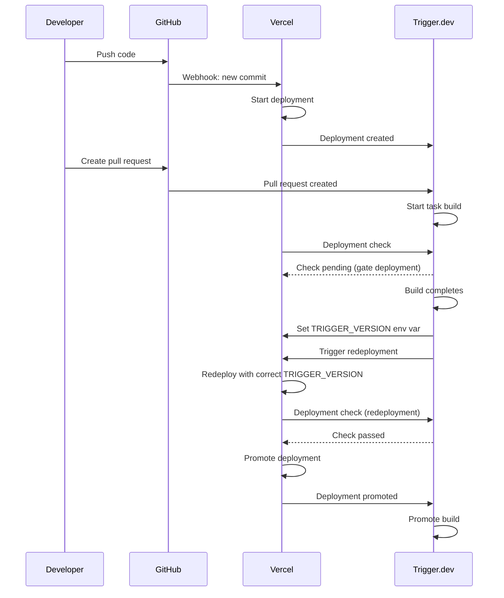

> Sources:
> - https://trigger.dev/docs/deployment/overview
> - https://trigger.dev/docs/deploy-environment-variables
> - https://trigger.dev/docs/deployment/preview-branches
> - https://trigger.dev/docs/deployment/atomic-deployment
> - https://trigger.dev/docs/vercel-integration
> - https://trigger.dev/docs/github-integration

# Deployment

## Deployment

Learn how to deploy your tasks to Trigger.dev.

Before you can run production workloads on Trigger.dev, you need to deploy your tasks. The only way to do this at the moment is through the [deploy CLI command](/cli-deploy):

<CodeGroup>
  ```bash npm theme={"theme":"css-variables"}
  npx trigger.dev@latest deploy
  ```

  ```bash pnpm theme={"theme":"css-variables"}
  pnpm dlx trigger.dev@latest deploy
  ```

  ```bash yarn theme={"theme":"css-variables"}
  yarn dlx trigger.dev@latest deploy
  ```
</CodeGroup>

## Deploying 101

Let's assume you have an existing trigger.dev project with a few tasks that you have been running locally but now want to deploy to the Trigger.dev cloud (or your self-hosted instance).

First, let's make sure you are logged in to the CLI (if you haven't already):

```bash theme={"theme":"css-variables"}
npx trigger.dev login
```

This will open a browser window where you can log in with your Trigger.dev account and link your CLI.

Now you can deploy your tasks:

```bash theme={"theme":"css-variables"}
npx trigger.dev deploy
```

This should print out a success message and let you know a new version has been deployed:

```bash theme={"theme":"css-variables"}
Trigger.dev (3.3.16)
------------------------------------------------------
┌  Deploying project
│
◇  Retrieved your account details for eric@trigger.dev
│
◇  Successfully built code
│
◇  Successfully deployed version 20250228.1
│
└  Version 20250228.1 deployed with 4 detected tasks
```

Now if you visit your Trigger.dev dashboard you should see the new version deployed:


<Note>
  Deploying consists of building your tasks and uploading them to the Trigger.dev cloud. This
  process can take a few seconds to a few minutes depending on the size of your project.
</Note>

## Triggering deployed tasks

Once you have deployed your tasks, you can trigger tasks exactly the same way you did locally, but with the "PROD" API key:


Copy the API key from the dashboard and set the `TRIGGER_SECRET_KEY` environment variable, and then any tasks you trigger will run against the deployed version:

```txt .env theme={"theme":"css-variables"}
TRIGGER_SECRET_KEY="tr_prod_abc123"
```

Now you can trigger your tasks:

```ts theme={"theme":"css-variables"}
import { myTask } from "./trigger/tasks";

await myTask.trigger({ foo: "bar" });
```

See our [triggering tasks](/triggering) guide for more information.

## Versions

When you deploy your tasks, Trigger.dev creates a new version of all tasks in your project. A version is a snapshot of your tasks at a certain point in time. This ensures that tasks are not affected by changes to the code.

### Current version

When you deploy, the version number is automatically incremented, and the new version is set as the current version for that environment.

<Note>
  A single environment (prod, staging, etc.) can only have a single "current" version at a time.
</Note>

The current version defines which version of the code new task runs will execute against. When a task run starts, it is locked to the current version. This ensures that the task run is not affected by changes to the code. Retries of the task run will also be locked to the original version.

<Note>
  When you Replay a run in the dashboard we will create a new run, locked to the current version and
  not necessarily the version of the original run.
</Note>

### Version locking

You can optionally specify the version when triggering a task using the `version` parameter. This is useful when you want to run a task against a specific version of the code:

```ts theme={"theme":"css-variables"}
await myTask.trigger({ foo: "bar" }, { version: "20250228.1" });
```

If you want to set a global version to run all tasks against, you can use the `TRIGGER_VERSION` environment variable:

```bash theme={"theme":"css-variables"}
TRIGGER_VERSION=20250228.1
```

### Child tasks and auto-version locking

Trigger and wait functions version lock child task runs to the parent task run version. This ensures the results from child runs match what the parent task is expecting. If you don't wait then version locking doesn't apply.

| Trigger function        | Parent task version | Child task version | isLocked |
| ----------------------- | ------------------- | ------------------ | -------- |
| `trigger()`             | `20240313.2`        | Current            | No       |
| `batchTrigger()`        | `20240313.2`        | Current            | No       |
| `triggerAndWait()`      | `20240313.2`        | `20240313.2`       | Yes      |
| `batchTriggerAndWait()` | `20240313.2`        | `20240313.2`       | Yes      |

### Skipping promotion

When you deploy, the new version is automatically promoted be the current version. If you want to skip this promotion, you can use the `--skip-promotion` flag:

```bash theme={"theme":"css-variables"}
npx trigger.dev deploy --skip-promotion
```

This will create a new deployment version but not promote it to the current version:


This allows you to deploy and test a new version without affecting new task runs. When you want to promote the version, you can do so from the CLI:

```bash theme={"theme":"css-variables"}
npx trigger.dev promote 20250228.1
```

Or from the dashboard:


To learn more about skipping promotion and how this enables atomic deployments, see our [Atomic deployment](/deployment/atomic-deployment) guide.

## Staging deploys

By default, the `deploy` command will deploy to the `prod` environment. If you want to deploy to a different environment, you can use the `--env` flag:

```bash theme={"theme":"css-variables"}
npx trigger.dev deploy --env staging
```

<Note>
  If you are using the Trigger.dev Cloud, staging deploys are only available on the Hobby and Pro
  plans.
</Note>

This will create an entirely new version of your tasks for the `staging` environment, with a new version number and an independent current version:


Now you can trigger tasks against the staging environment by setting the `TRIGGER_SECRET_KEY` environment variable to the staging API key:

```txt .env theme={"theme":"css-variables"}
TRIGGER_SECRET_KEY="tr_stg_abcd123"
```

For additional environments beyond `prod` and `staging`, you can use [preview branches](/deployment/preview-branches), which allow you to create isolated environments for each branch of your code.

## Local builds

By default we use a remote build provider to speed up builds. However, you can also force the build to happen locally on your machine using the `--force-local-build` flag:

```bash theme={"theme":"css-variables"}
npx trigger.dev deploy --force-local-build
```

<Tip>
  Deploying with local builds can be a useful fallback in cases where our remote build provider is experiencing availability issues.
</Tip>

### System requirements

To use local builds, you need the following tools installed on your machine:

* Docker ([installation guide](https://docs.docker.com/get-started/get-docker))
* Docker Buildx ([installation guide](https://github.com/docker/buildx#installing))

## Environment variables

To add custom environment variables to your deployed tasks, you need to add them to your project in the Trigger.dev dashboard, or automatically sync them using our [syncEnvVars](/config/config-file#syncenvvars) or [syncVercelEnvVars](/config/config-file#syncvercelenvvars) build extensions.

For more information on environment variables, see our [environment variables](/deploy-environment-variables) guide.

## Troubleshooting

When things go wrong with your deployment, there are a few things you can do to diagnose the issue:

### Dry runs

You can do a "dry run" of the deployment to see what is built and uploaded without actually deploying:

```bash theme={"theme":"css-variables"}
npx trigger.dev deploy --dry-run

#  Dry run complete. View the built project at /<project path>/.trigger/tmp/<build dir>
```

The dry run will output the build directory where you can inspect the built tasks and dependencies. You can also compress this directory and send it to us if you need help debugging.

### Debug logs

You can run the deploy command with `--log-level debug` at the end. This will print out a lot of information about the deploy. If you can't figure out the problem from the information below please join [our Discord](https://trigger.dev/discord) and create a help forum post. Do NOT share the extended debug logs publicly as they might reveal private information about your project.

### Common issues

#### `Failed to build project image: Error building image`

There should be a link below the error message to the full build logs on your machine. Take a look at these to see what went wrong. Join [our Discord](https://trigger.dev/discord) and you share it privately with us if you can't figure out what's going wrong. Do NOT share these publicly as the verbose logs might reveal private information about your project.

Sometimes these errors are caused by upstream availability issues with our remote build provider. In this case, you can try deploying with a local build using the `--force-local-build` flag. Refer to the [Local builds](#local-builds) section for more information.

#### `Deployment encountered an error`

Usually there will be some useful guidance below this message. If you can't figure out what's going wrong then join [our Discord](https://trigger.dev/discord) and create a Help forum post with a link to your deployment.

#### `No loader is configured for ".node" files`

This happens because `.node` files are native code and can't be bundled like other packages. To fix this, add your package to [`build.external`](/config/config-file#external) in the `trigger.config.ts` file like this:

```ts trigger.config.ts theme={"theme":"css-variables"}
import { defineConfig } from "@trigger.dev/sdk";

export default defineConfig({
  project: "<project ref>",
  // Your other config settings...
  build: {
    external: ["your-node-package"],
  },
});
```

### `Cannot find matching keyid`

This error occurs when using Node.js v22 with corepack, as it's not yet compatible with the latest package manager signatures. To fix this, either:

1. Downgrade to Node.js v20 (LTS), or
2. Install corepack globally: `npm i -g corepack@latest`

The corepack bug and workaround are detailed in [this issue](https://github.com/npm/cli/issues/8075).

---

## Environment Variables

Any environment variables used in your tasks need to be added so the deployed code will run successfully.

An environment variable in Node.js is accessed in your code using `process.env.MY_ENV_VAR`.

We deploy your tasks and scale them up and down when they are triggered. So any environment variables you use in your tasks need to accessible to us so your code will run successfully.

## In the dashboard

### Setting environment variables

<Steps>
  <Step title="Go to the Environment Variables page">
    In the sidebar select the "Environment Variables" page, then press the "New environment variable"
    button. 
  </Step>

  <Step title="Add your environment variables">
    You can add values for your local dev environment, staging and prod. 
  </Step>
</Steps>

<Note>
  Specifying Dev values is optional. They will be overriden by values in your .env file when running
  locally.
</Note>

### Editing environment variables

You can edit an environment variable's values. You cannot edit the key name, you must delete and create a new one.

<Steps>
  <Step title="Press the action button on a variable">
    
  </Step>

  <Step title="Press edit">
    
  </Step>
</Steps>

### Deleting environment variables

<Warn>
  Environment variables are fetched and injected before a runs begins. So if you delete one you can
  cause runs to fail that are expecting variables to be set.
</Warn>

<Steps>
  <Step title="Press the action button on a variable">
    
  </Step>

  <Step title="Press delete">
    This will immediately delete the variable. 
  </Step>
</Steps>

## Local development

When running `npx trigger.dev dev`, the CLI automatically loads environment variables from these files in order (later files override any duplicate keys from earlier ones):

* `.env`
* `.env.development`
* `.env.local`
* `.env.development.local`
* `dev.vars`

These variables are available to your tasks via `process.env`. You don't need to use the `--env-file` flag for this automatic loading.

## In your code

You can use our SDK to get and manipulate environment variables. You can also easily sync environment variables from another service into Trigger.dev.

### Directly manipulating environment variables

We have a complete set of SDK functions (and REST API) you can use to directly manipulate environment variables.

| Function                                           | Description                                                 |
| -------------------------------------------------- | ----------------------------------------------------------- |
| [envvars.list()](/management/envvars/list)         | List all environment variables                              |
| [envvars.upload()](/management/envvars/import)     | Upload multiple env vars. You can override existing values. |
| [envvars.create()](/management/envvars/create)     | Create a new environment variable                           |
| [envvars.retrieve()](/management/envvars/retrieve) | Retrieve an environment variable                            |
| [envvars.update()](/management/envvars/update)     | Update a single environment variable                        |
| [envvars.del()](/management/envvars/delete)        | Delete a single environment variable                        |

#### Initial load from .env file

To initially load environment variables from a `.env` file into your Trigger.dev cloud environment, you can use `envvars.upload()`. This is useful for one-time bulk imports when setting up a new project or environment.

```ts theme={"theme":"css-variables"}
import { envvars } from "@trigger.dev/sdk";
import { readFileSync } from "fs";
import { parse } from "dotenv";

// Read and parse your .env file
const envContent = readFileSync(".env.production", "utf-8");
const parsed = parse(envContent);

// Upload to Trigger.dev (replace with your project ref and environment slug)
await envvars.upload("proj_your_project_ref", "prod", {
  variables: parsed,
  override: false, // Set to true to override existing variables
});
```

When called inside a task, you can omit the project ref and environment slug as they'll be automatically inferred from the task context:

```ts theme={"theme":"css-variables"}
import { envvars, task } from "@trigger.dev/sdk";
import { readFileSync } from "fs";
import { parse } from "dotenv";

export const setupEnvVars = task({
  id: "setup-env-vars",
  run: async () => {
    const envContent = readFileSync(".env.production", "utf-8");
    const parsed = parse(envContent);

    // projectRef and environment slug are automatically inferred from ctx
    await envvars.upload({
      variables: parsed,
      override: false,
    });
  },
});
```

<Note>
  This is different from `syncEnvVars` which automatically syncs variables during every deploy. Use `envvars.upload()` for one-time initial loads, and `syncEnvVars` for ongoing synchronization.
</Note>

#### Getting the current environment

When using `envvars.retrieve()` inside a task, you can access the current environment information from the task context (`ctx`). The `envvars.retrieve()` function doesn't return the environment, but you can get it from `ctx.environment`:

```ts theme={"theme":"css-variables"}
import { envvars, task } from "@trigger.dev/sdk";

export const myTask = task({
  id: "my-task",
  run: async (payload, { ctx }) => {
    // Get the current environment information
    const currentEnv = ctx.environment.slug; // e.g., "dev", "prod", "staging"
    const envType = ctx.environment.type; // e.g., "DEVELOPMENT", "PRODUCTION", "STAGING", "PREVIEW"

    // Retrieve an environment variable
    // When called inside a task, projectRef and slug are automatically inferred
    const apiKey = await envvars.retrieve("API_KEY");

    console.log(`Retrieved API_KEY from environment: ${currentEnv} (${envType})`);
    console.log(`Value: ${apiKey.value}`);
  },
});
```

The context object provides:

* `ctx.environment.slug` - The environment slug (e.g., "dev", "prod")
* `ctx.environment.type` - The environment type ("DEVELOPMENT", "PRODUCTION", "STAGING", or "PREVIEW")
* `ctx.environment.id` - The environment ID
* `ctx.project.ref` - The project reference

For more information about the context object, see the [Context documentation](/context).

### Sync env vars from another service

You could use the SDK functions above but it's much easier to use our `syncEnvVars` build extension in your `trigger.config` file.

<Note>
  To use the `syncEnvVars` build extension, you should first install the `@trigger.dev/build`
  package into your devDependencies.
</Note>

In this example we're using env vars from [Infisical](https://infisical.com).

```ts trigger.config.ts theme={"theme":"css-variables"}
import { defineConfig } from "@trigger.dev/sdk";
import { syncEnvVars } from "@trigger.dev/build/extensions/core";
import { InfisicalSDK } from "@infisical/sdk";

export default defineConfig({
  build: {
    extensions: [
      syncEnvVars(async (ctx) => {
        const client = new InfisicalSDK();

        await client.auth().universalAuth.login({
          clientId: process.env.INFISICAL_CLIENT_ID!,
          clientSecret: process.env.INFISICAL_CLIENT_SECRET!,
        });

        const { secrets } = await client.secrets().listSecrets({
          environment: ctx.environment,
          projectId: process.env.INFISICAL_PROJECT_ID!,
        });

        return secrets.map((secret) => ({
          name: secret.secretKey,
          value: secret.secretValue,
        }));
      }),
    ],
  },
});
```

#### Syncing environment variables from Vercel

To sync environment variables from your Vercel projects to Trigger.dev, you can use our build extension. Check out our [syncing environment variables from Vercel guide](/guides/examples/vercel-sync-env-vars).

#### Deploy

When you run the [CLI deploy command](/cli-deploy) directly or using [GitHub Actions](/github-actions) it will sync the environment variables from [Infisical](https://infisical.com) to Trigger.dev. This means they'll appear on the Environment Variables page so you can confirm that it's worked.

This means that you need to redeploy your Trigger.dev tasks if you change the environment variables in [Infisical](https://infisical.com).

<Note>
  The `process.env.INFISICAL_CLIENT_ID`, `process.env.INFISICAL_CLIENT_SECRET` and
  `process.env.INFISICAL_PROJECT_ID` will need to be supplied to the `deploy` CLI command. You can
  do this via the `--env-file .env` flag or by setting them as environment variables in your
  terminal.
</Note>

#### Dev

`syncEnvVars` does not have any effect when running the `dev` command locally. If you want to inject environment variables from another service into your local environment you can do so via a `.env` file or just supplying them as environment variables in your terminal. Most services will have a CLI tool that allows you to run a command with environment variables set:

```sh theme={"theme":"css-variables"}
infisical run -- npx trigger.dev@latest dev
```

Any environment variables set in the CLI command will be available to your local Trigger.dev tasks.

### The syncEnvVars callback return type

You can return env vars as an object with string keys and values, or an array of names + values.

```ts theme={"theme":"css-variables"}
return {
  MY_ENV_VAR: "my value",
  MY_OTHER_ENV_VAR: "my other value",
};
```

or

```ts theme={"theme":"css-variables"}
return [
  {
    name: "MY_ENV_VAR",
    value: "my value",
  },
  {
    name: "MY_OTHER_ENV_VAR",
    value: "my other value",
  },
];
```

This should mean that for most secret services you won't need to convert the data into a different format.

### Using Google credential JSON files

Securely pass a Google credential JSON file to your Trigger.dev task using environment variables.

<Steps>
  <Step title="Convert the Google credential file to base64">
    In your terminal, run the following command and copy the resulting base64 string:

    ```
    base64 -i path/to/your/service-account-file.json
    ```
  </Step>

  <Step title="Set up the environment variable in Trigger.dev">
    Follow [these steps](/deploy-environment-variables) to set a new environment variable using the base64 string as the value.

    ```
    GOOGLE_CREDENTIALS_BASE64="<your base64 string>"
    ```
  </Step>

  <Step title="Use the environment variable in your code">
    Add the following code to your Trigger.dev task:

    ```ts theme={"theme":"css-variables"}
    import { google } from "googleapis";

    const credentials = JSON.parse(
      Buffer.from(process.env.GOOGLE_CREDENTIALS_BASE64, "base64").toString("utf8")
    );

    const auth = new google.auth.GoogleAuth({
      credentials,
      scopes: ["https://www.googleapis.com/auth/cloud-platform"],
    });

    const client = await auth.getClient();
    ```
  </Step>

  <Step title="Use the client in your code">
    You can now use the `client` object to make authenticated requests to Google APIs
  </Step>
</Steps>

## Using `.env.production` or dotenvx with Trigger.dev

Trigger.dev does not automatically load `.env.production` files or dotenvx files during deploys.\
To use these files in your Trigger.dev environment:

### Option 1 — Manually add your environment variables

1. Open your `.env.production` (or `.env`) file
2. Copy the full contents
3. Go to your Trigger.dev project → **Environment Variables**
4. Click **Add variables**
5. Paste the contents directly into the editor

Trigger.dev will automatically parse and create each key/value pair.

This is the simplest way to bring dotenvx or `.env.production` variables into your Trigger.dev environment.

### Option 2 — Sync variables automatically using `syncEnvVars`

If you'd prefer an automated flow, you can use the `syncEnvVars` build extension to programmatically load and return your variables:

```ts theme={"theme":"css-variables"}
import { defineConfig } from "@trigger.dev/sdk";
import { syncEnvVars } from "@trigger.dev/build/extensions/core";
import dotenvx from "@dotenvx/dotenvx";
import { readFileSync } from "fs";

export default defineConfig({
  project: "<project id>",
  build: {
    extensions: [
      syncEnvVars(async () => {
        const envContent = readFileSync(".env.production", "utf-8");
        const parsed = dotenvx.parse(envContent);
        return parsed ?? {};
      }),
    ],
  },
});
```

This will read your .env.production file using dotenvx and sync the variables to Trigger.dev during every deploy.

**Summary**

* Trigger.dev does not automatically detect .env.production or dotenvx files
* You can paste them manually into the dashboard
* Or sync them automatically using a build extension

## Multi-tenant applications

If you're building a multi-tenant application where each tenant needs different environment variables (like tenant-specific API keys or database credentials), you don't need a separate project for each tenant. Instead, use a single project and load tenant-specific secrets at runtime.

<Note>
  This is different from [syncing environment variables at deploy time](#sync-env-vars-from-another-service).
  Here, secrets are loaded dynamically during task execution, not synced to Trigger.dev's environment variables.
</Note>

### Recommended approach

Use a secrets service (Infisical, AWS Secrets Manager, HashiCorp Vault, etc.) to store tenant-specific secrets, then retrieve them at the start of each task run based on the tenant identifier in your payload or context.

**Important:** Never pass secrets in the task payload, as payloads are logged and visible in the dashboard.

### Example implementation

```ts theme={"theme":"css-variables"}
import { task } from "@trigger.dev/sdk";
import { SecretsManagerClient, GetSecretValueCommand } from "@aws-sdk/client-secrets-manager";

export const processTenantData = task({
  id: "process-tenant-data",
  run: async (payload: { tenantId: string; data: unknown }) => {
    // Retrieve tenant-specific secret at runtime
    const client = new SecretsManagerClient({ region: "us-east-1" });
    const response = await client.send(
      new GetSecretValueCommand({
        SecretId: `tenants/${payload.tenantId}/supabase-key`,
      })
    );

    const supabaseKey = JSON.parse(response.SecretString!).SUPABASE_SERVICE_KEY;

    // Your task logic using the tenant-specific secret
    // ...
  },
});
```

You can use any secrets service - see the [sync env vars section](#sync-env-vars-from-another-service) for an example with Infisical.

### Benefits

* **Single codebase** - Deploy once, works for all tenants
* **Secure** - Secrets never appear in payloads or logs
* **Scalable** - No project limit constraints
* **Flexible** - Easy to add new tenants without redeploying

This approach allows you to support unlimited tenants with a single Trigger.dev project, avoiding the [project limit](/limits#projects) while maintaining security and separation of tenant data.

---

## Preview branches

Create isolated environments for each branch of your code, allowing you to test changes before merging to production. You can create preview branches manually or automatically from your git branches.

## How to use preview branches

The preview environment is special – you create branches from it. The branches you create live under the preview environment and have all the features you're used to from other environments (like staging or production). That means you can trigger runs, have schedules, test them, use Realtime, etc.


We recommend you automatically create a preview branch for each git branch when a Pull Request is opened and then archive it automatically when the PR is merged/closed.

The process to use preview branches looks like this:

1. Create a preview branch
2. Deploy to the preview branch (1+ times)
3. Trigger runs using your Preview API key (`TRIGGER_SECRET_KEY`) and the branch name (`TRIGGER_PREVIEW_BRANCH`).
4. Archive the preview branch when the branch is done.

There are two main ways to do this:

1. Automatically: using GitHub Actions (recommended).
2. Manually: in the dashboard and/or using the CLI.

### Limits on active preview branches

We restrict the number of active preview branches (per project). You can archive a preview branch at any time (automatically or manually) to unlock another slot – or you can upgrade your plan.

Once archived you can still view the dashboard for the branch but you can't trigger or execute runs (or other write operations).

This limit exists because each branch has an independent concurrency limit. For the Cloud product these are the limits:

| Plan  | Active preview branches |
| ----- | ----------------------- |
| Free  | 0                       |
| Hobby | 5                       |
| Pro   | 20 (then paid for more) |

For full details see our [pricing page](https://trigger.dev/pricing).

## Triggering runs and using the SDK

Before we talk about how to deploy to preview branches, one important thing to understand is that you must set the `TRIGGER_PREVIEW_BRANCH` environment variable as well as the `TRIGGER_SECRET_KEY` environment variable.

When deploying to somewhere that supports `process.env` (like Node.js runtimes) you can just set the environment variables:

```bash theme={"theme":"css-variables"}
TRIGGER_SECRET_KEY="tr_preview_1234567890"
TRIGGER_PREVIEW_BRANCH="your-branch-name"
```

If you're deploying somewhere that doesn't support `process.env` (like some edge runtimes) you can manually configure the SDK:

```ts theme={"theme":"css-variables"}
import { configure } from "@trigger.dev/sdk";
import { myTask } from "./trigger/myTasks";

configure({
  secretKey: "tr_preview_1234567890", // WARNING: Never actually hardcode your secret key like this
  previewBranch: "your-branch-name",
});

async function triggerTask() {
  await myTask.trigger({ userId: "1234" }); // Trigger a run in your-branch-name
}
```

## Preview branches with GitHub Actions (recommended)

This GitHub Action will:

1. Automatically create a preview branch for your Pull Request (if the branch doesn't already exist).
2. Deploy the preview branch.
3. Archive the preview branch when the Pull Request is merged/closed. This only works if your workflow runs on **closed** PRs (`types: [opened, synchronize, reopened, closed]`). If you omit `closed`, branches won't be archived automatically.

```yml .github/workflows/trigger-preview-branches.yml theme={"theme":"css-variables"}
name: Deploy to Trigger.dev (preview branches)

on:
  pull_request:
    types: [opened, synchronize, reopened, closed]

jobs:
  deploy-preview:
    runs-on: ubuntu-latest
    steps:
      - uses: actions/checkout@v4

      - name: Use Node.js 20.x
        uses: actions/setup-node@v4
        with:
          node-version: "20.x"

      - name: Install dependencies
        run: npm install

      - name: Deploy preview branch
        run: npx trigger.dev@latest deploy --env preview
        env:
          TRIGGER_ACCESS_TOKEN: ${{ secrets.TRIGGER_ACCESS_TOKEN }}
```

For this workflow to work, you need to set the following secrets in your GitHub repository:

* `TRIGGER_ACCESS_TOKEN`: A Trigger.dev personal access token (they start with `tr_pat_`). [Learn how to create one and set it in GitHub](/github-actions#creating-a-personal-access-token).

Notice that the deploy command has `--env preview` at the end. We automatically detect the preview branch from the GitHub actions env var.

You can manually specify the branch using `--branch <branch-name>` in the deploy command, but this isn't required.

## Preview branches with the CLI (manual)

### Deploying a preview branch

Creating and deploying a preview branch manually is easy:

```bash theme={"theme":"css-variables"}
npx trigger.dev@latest deploy --env preview
```

This will create and deploy a preview branch, automatically detecting the git branch. If for some reason the auto-detection doesn't work it will let you know and tell you do this:

```bash theme={"theme":"css-variables"}
npx trigger.dev@latest deploy --env preview --branch your-branch-name
```

### Archiving a preview branch

You can manually archive a preview branch with the CLI:

```bash theme={"theme":"css-variables"}
npx trigger.dev@latest preview archive
```

Again we will try auto-detect the current branch. But you can specify the branch name with `--branch <branch-name>`.

## Creating and archiving preview branches from the dashboard

From the "Preview branches" page you can create a branch:


You can also archive a branch:


## Environment variables

You can set environment variables for "Preview" and they will get applied to all branches (existing and new). You can also set environment variables for a specific branch. If they are set for both then the branch-specific variables will take precedence.


These can be set manually in the dashboard, or automatically at deploy time using the [syncEnvVars()](/config/extensions/syncEnvVars) or [syncVercelEnvVars()](/config/extensions/syncEnvVars#syncvercelenvvars) build extensions.

### Sync environment variables

Full instructions are in the [syncEnvVars()](/config/extensions/syncEnvVars) documentation.

```ts trigger.config.ts theme={"theme":"css-variables"}
import { defineConfig } from "@trigger.dev/sdk";
// You will need to install the @trigger.dev/build package
import { syncEnvVars } from "@trigger.dev/build/extensions/core";

export default defineConfig({
  //... other config
  build: {
    // This will automatically detect and sync environment variables
    extensions: [
      syncEnvVars(async (ctx) => {
        // You can fetch env variables from a 3rd party service like Infisical, Hashicorp Vault, etc.
        // The ctx.branch will be set if it's a preview deployment.
        return await fetchEnvVars(ctx.environment, ctx.branch);
      }),
    ],
  },
});
```

### Sync Vercel environment variables

You need to set the `VERCEL_ACCESS_TOKEN`, `VERCEL_PROJECT_ID` and `VERCEL_TEAM_ID` environment variables. You can find these in the Vercel dashboard. Full instructions are in the [syncVercelEnvVars()](/config/extensions/syncEnvVars#syncvercelenvvars) documentation.

The extension will automatically detect a preview branch deploy from Vercel and sync the appropriate environment variables.

```ts trigger.config.ts theme={"theme":"css-variables"}
import { defineConfig } from "@trigger.dev/sdk";
// You will need to install the @trigger.dev/build package
import { syncVercelEnvVars } from "@trigger.dev/build/extensions/core";

export default defineConfig({
  //... other config
  build: {
    // This will automatically detect and sync environment variables
    extensions: [syncVercelEnvVars()],
  },
});
```

---

## Atomic deploys

Use atomic deploys to coordinate changes to your tasks and your application.

Atomic deploys in Trigger.dev allow you to synchronize the deployment of your application with a specific version of your tasks. This ensures that your application always uses the correct version of its associated tasks, preventing inconsistencies or errors due to version mismatches.

## How it works

Atomic deploys achieve synchronization by deploying your tasks to Trigger.dev without promoting them to the default version. Instead, you explicitly specify the deployed task version in your application’s environment. Here’s the process at a glance:

1. **Deploy Tasks to Trigger.dev**: Use the Trigger.dev CLI to deploy your tasks with the `--skip-promotion` flag. This creates a new task version without making it the default.
2. **Capture the Deployment Version**: The CLI outputs the version of the deployed tasks, which you’ll use in the next step.
3. **Deploy Your Application**: Deploy your application (e.g., to Vercel), setting an environment variable like `TRIGGER_VERSION` to the captured task version.

## Vercel CLI & GitHub Actions

If you deploy to Vercel via their CLI, you can use this sample workflow that demonstrates performing atomic deploys with GitHub Actions, Trigger.dev, and Vercel:

```yml theme={"theme":"css-variables"}
name: Deploy to Trigger.dev (prod)
on:
  push:
    branches:
      - main
concurrency:
  group: ${{ github.workflow }}
  cancel-in-progress: true
jobs:
  deploy:
    runs-on: ubuntu-latest
    steps:
      - uses: actions/checkout@v4

      - name: Use Node.js 20.x
        uses: actions/setup-node@v4
        with:
          node-version: "20.x"

      - name: Install dependencies
        run: npm install

      - name: Deploy Trigger.dev
        id: deploy-trigger
        env:
          TRIGGER_ACCESS_TOKEN: ${{ secrets.TRIGGER_ACCESS_TOKEN }}
        run: |
          npx trigger.dev@latest deploy --skip-promotion

      - name: Deploy to Vercel
        run: npx vercel --yes --prod -e TRIGGER_VERSION=$TRIGGER_VERSION --token $VERCEL_TOKEN
        env:
          VERCEL_TOKEN: ${{ secrets.VERCEL_TOKEN }}
          TRIGGER_VERSION: ${{ steps.deploy-trigger.outputs.deploymentVersion }}

      - name: Promote Trigger.dev Version
        run: npx trigger.dev@latest promote $TRIGGER_VERSION
        env:
          TRIGGER_ACCESS_TOKEN: ${{ secrets.TRIGGER_ACCESS_TOKEN }}
          TRIGGER_VERSION: ${{ steps.deploy-trigger.outputs.deploymentVersion }}
```

* Deploy to Trigger.dev

  * The `npx trigger.dev deploy` command uses `--skip-promotion` to deploy the tasks without setting the version as the default.
  * The step’s id: `deploy-trigger` allows us to capture the deployment version in the output (deploymentVersion).

* Deploy to Vercel:
  * The `npx vercel` command deploys the application, setting the `TRIGGER_VERSION` environment variable to the task version from the previous step.
  * The --prod flag ensures a production deployment, and -e passes the environment variable.
  * The `@trigger.dev/sdk` automatically uses the `TRIGGER_VERSION` environment variable to trigger the correct version of the tasks.

For this workflow to work, you need to set up the following secrets in your GitHub repository:

* `TRIGGER_ACCESS_TOKEN`: Your Trigger.dev personal access token. View the instructions [here](/github-actions) to learn more.
* `VERCEL_TOKEN`: Your Vercel personal access token. You can find this in your Vercel account settings.

## Vercel GitHub integration

If you're are using Vercel, chances are you are using their GitHub integration and deploying your application directly from pushes to GitHub. This section covers how to achieve atomic deploys with Trigger.dev in this setup.

### Turn off automatic promotion

By default, Vercel automatically promotes new deployments to production. To prevent this, you need to disable the auto-promotion feature in your Vercel project settings:

1. Go to your Production environment settings in Vercel at `https://vercel.com/<team-slug>/<project-slug>/settings/environments/production`
2. Disable the "Auto-assign Custom Production Domains" setting:


3. Hit the "Save" button to apply the changes.

Now whenever you push to your main branch, Vercel will deploy your application to the production environment without promoting it, and you can control the promotion manually.

### Deploy with Trigger.dev

Now we want to deploy that same commit to Trigger.dev, and then promote the Vercel deployment when that completes. Here's a sample GitHub Actions workflow that does this:

```yml theme={"theme":"css-variables"}
name: Deploy to Trigger.dev (prod)

on:
  push:
    branches:
      - main

concurrency:
  group: ${{ github.workflow }}
  cancel-in-progress: true

jobs:
  deploy:
    runs-on: ubuntu-latest

    steps:
      - uses: actions/checkout@v4

      - name: Use Node.js 20.x
        uses: actions/setup-node@v4
        with:
          node-version: "20.x"

      - name: Install dependencies
        run: npm install

      - name: Wait for vercel deployment (push)
        id: wait-for-vercel
        uses: ludalex/vercel-wait@v1
        with:
          project-id: ${{ secrets.VERCEL_PROJECT_ID }}
          team-id: ${{ secrets.VERCEL_SCOPE_NAME }}
          token: ${{ secrets.VERCEL_TOKEN }}
          sha: ${{ github.sha }}

      - name: 🚀 Deploy Trigger.dev
        id: deploy-trigger
        env:
          TRIGGER_ACCESS_TOKEN: ${{ secrets.TRIGGER_ACCESS_TOKEN }}
        run: |
          npx trigger.dev@latest deploy

      - name: Promote Vercel deploy
        run: npx vercel promote $VERCEL_DEPLOYMENT_ID --yes --token $VERCEL_TOKEN --scope $VERCEL_SCOPE_NAME
        env:
          VERCEL_DEPLOYMENT_ID: ${{ steps.wait-for-vercel.outputs.deployment-id }}
          VERCEL_TOKEN: ${{ secrets.VERCEL_TOKEN }}
          VERCEL_SCOPE_NAME: ${{ secrets.VERCEL_SCOPE_NAME }}
```

This workflow does the following:

1. Waits for the Vercel deployment to complete using the `ludalex/vercel-wait` action.
2. Deploys the tasks to Trigger.dev using the `npx trigger.dev deploy` command. There's no need to use the `--skip-promotion` flag because we want to promote the deployment.
3. Promotes the Vercel deployment using the `npx vercel promote` command.

For this workflow to work, you need to set up the following secrets in your GitHub repository:

* `TRIGGER_ACCESS_TOKEN`: Your Trigger.dev personal access token. View the instructions [here](/github-actions) to learn more.
* `VERCEL_TOKEN`: Your Vercel personal access token. You can find this in your Vercel account settings.
* `VERCEL_PROJECT_ID`: Your Vercel project ID. You can find this in your Vercel project settings.
* `VERCEL_SCOPE_NAME`: Your Vercel team slug.

Checkout our [example repo](https://github.com/ericallam/vercel-atomic-deploys) to see this workflow in action.

<Note>
  We are using the `ludalex/vercel-wait` action above as a fork of the [official
  tj-actions/vercel-wait](https://github.com/tj-actions/vercel-wait) action because there is a bug
  in the official action that exits early if the deployment isn't found in the first check and due
  to the fact that it supports treating skipped (cancelled) Vercel deployments as valid (on by default).
  I've opened a PR for this issue [here](https://github.com/tj-actions/vercel-wait/pull/106).
</Note>

---

## Vercel integration

Automatically deploy your tasks whenever you deploy to Vercel.

## How it works

The Vercel integration connects your Vercel project to your Trigger.dev project so that every Vercel deployment automatically triggers a Trigger.dev deployment. It also syncs environment variables from Vercel into Trigger.dev and supports atomic deployments to keep your app and tasks in sync.

This eliminates the need to manually run the `trigger.dev deploy` command or maintain custom CI/CD workflows for Vercel-based projects.

<Note>
  The Vercel integration requires the [GitHub integration](/github-integration) to be connected as
  well, since Trigger.dev builds your tasks from your GitHub repository.
</Note>

## Installation

You can connect Vercel from two entry points:

### From the Trigger.dev dashboard

<Steps>
  <Step title="Connect Vercel">
    Go to your project's **Settings** page and click **Connect Vercel**. This will redirect you to
    Vercel to authorize the Trigger.dev app.
  </Step>

  <Step title="Select a Vercel project">
    Choose which Vercel project to connect to your Trigger.dev project.
  </Step>

  <Step title="Map environments">
    If your Vercel project has custom environments, choose which one maps to your Trigger.dev staging
    environment.
  </Step>

  <Step title="Sync environment variables">
    Review the environment variables that will be pulled from Vercel into Trigger.dev. You can
    deselect any variables you don't want to sync.
  </Step>

  <Step title="Configure build options">
    Optionally adjust [build options](#build-options) for atomic deployments, env var pulling, and new
    env var discovery.
  </Step>

  <Step title="Connect GitHub">
    If your GitHub repository isn't already connected, you'll be prompted to connect it.
  </Step>
</Steps>

### From the Vercel Marketplace

<Steps>
  <Step title="Install the integration">
    Install the [Trigger.dev integration from the Vercel
    Marketplace](https://vercel.com/marketplace/trigger). This will redirect you to Trigger.dev to
    complete setup.
  </Step>

  <Step title="Select your Trigger.dev organization and project">
    Choose which Trigger.dev organization and project to connect. If you're new to Trigger.dev, you'll
    be guided through creating an organization and project.
  </Step>

  <Step title="Connect GitHub">
    If your GitHub repository isn't already connected, you'll be prompted to connect it.
  </Step>
</Steps>

<Note>
  When installing from the Vercel Marketplace, default Build options are applied automatically. You
  can adjust them later in your project settings.
</Note>

<Warning>
  **Vercel Root Directory:** If your Vercel project uses a **Root Directory** (e.g. you deploy a
  single subfolder such as `app` or `web`), you may see "The specified Root Directory does not
  exist" after connecting the integration. If you see this error, try using the **repository root**
  (leave Root Directory empty) in your Vercel project settings. If your Vercel frontend build
  requires a Root Directory (e.g. in a monorepo), keep that setting in Vercel and instead point
  Trigger.dev to the subfolder by setting the **Trigger config file** path (and other [Build
  options](#build-options)) in your Trigger.dev project configuration. Trigger.dev always builds
  from the repo root.
</Warning>

## Environment variable sync

The integration syncs environment variables in both directions:

**Vercel → Trigger.dev**: Environment variables from your Vercel project are pulled into Trigger.dev. This happens during the initial setup and optionally before each build. Variables are synced per-environment (production, staging, preview).

**Trigger.dev → Vercel**: Trigger.dev syncs API keys (like `TRIGGER_SECRET_KEY`) to your Vercel project so your app can communicate with Trigger.dev.

The following variables are excluded from the Vercel → Trigger.dev sync:

* `TRIGGER_SECRET_KEY`, `TRIGGER_VERSION`, `TRIGGER_PREVIEW_BRANCH` (managed by Trigger.dev)
* Sensitive/secret-type variables (Vercel API limitation)

You can control sync behavior per-variable from your project's Vercel settings. Deselecting a variable prevents its value from being updated during future syncs.

<Warning>
  If you are experiencing incorrectly populated environment variables, check that you are not using
  the `syncVercelEnvVars` build extension in your `trigger.config.ts`. This extension is deprecated
  and conflicts with the Vercel integration's built-in env var syncing. Remove it if present.
</Warning>

### Supabase and Neon database branching

If you use [Supabase Branching](https://supabase.com/docs/guides/deployment/branching) or [Neon Database Branching](https://neon.tech/docs/guides/branching-intro) for preview environments, disable syncing for database env vars on the Environment Variables page and use the [syncSupabaseEnvVars](/config/extensions/syncEnvVars#syncsupabaseenvvars) or [syncNeonEnvVars](/config/extensions/syncEnvVars#syncneonenvvars) build extensions instead. These extensions automatically resolve the correct branch-specific credentials at build time.

## Atomic deployments

Atomic deployments ensure your Vercel app and Trigger.dev tasks are deployed in sync. When enabled, Trigger.dev gates your Vercel deployment until the task build completes, then triggers a Vercel redeployment with the correct `TRIGGER_VERSION` set. This guarantees your app always uses the matching version of your tasks.



Atomic deployments are enabled for the production environment by default.

<Note>
  When atomic deployments are enabled, the integration automatically disables `Auto-assign Custom
      Production Domains` on your Vercel project. This is required so that Vercel doesn't promote a
  deployment before the Trigger.dev build is ready.
</Note>

Previously, setting up atomic deployments with Vercel required custom GitHub Actions workflows. The Vercel integration automates this entirely. For more details on how atomic deployments work, see [Atomic deploys](/deployment/atomic-deployment).

## Environment mapping

The integration maps Vercel environments to Trigger.dev environments:

| Vercel environment | Trigger.dev environment        |
| ------------------ | ------------------------------ |
| Production         | Production                     |
| Custom environment | Staging (you choose which one) |
| Preview            | Preview                        |
| Development        | Development                    |

If your Vercel project has a custom environment, you can select which one maps to your Trigger.dev staging environment during setup or in your project settings.

<Note>
  Preview deployments require the preview environment to be enabled on your project. Learn more
  about [preview branches](/deployment/preview-branches).
</Note>

## Build options

You can configure the following settings per-environment from your project's Vercel settings:

* **Atomic deployments**: Controls whether Trigger.dev and Vercel deployments are synchronized. Enabled for production by default.
* **Pull env vars before build**: When enabled, Trigger.dev pulls the latest environment variables from Vercel before each build. Enabled for production, staging, and preview by default.
* **Discover new env vars**: When enabled, new environment variables found in Vercel that don't yet exist in Trigger.dev are created automatically during builds. Only available for environments that also have env var pulling enabled. Enabled for production, staging, and preview by default.

To change build options that would normally go in `trigger.config.ts` (such as [extensions](/config/config-file#extensions) or other build configuration), use **Build options** on your project's configuration page in the Trigger.dev dashboard.

## Disconnecting

You can disconnect the Vercel integration from either side:

* **From Trigger.dev**: Go to your project **Settings** and disconnect Vercel.
* **From Vercel**: Uninstall the Trigger.dev integration from your Vercel dashboard. This is automatically detected and the connection is removed on the Trigger.dev side.

Disconnecting stops automatic deployments, environment variable syncing, and deployment checks. Your existing deployments and environment variables are not affected.

## Related

* [GitHub integration](/github-integration)
* [Atomic deploys](/deployment/atomic-deployment)
* [Environment variables](/deploy-environment-variables)
* [Preview branches](/deployment/preview-branches)

---

## GitHub integration

Automatically deploy your tasks on every push to your GitHub repository.

## How it works

Once you connect a GitHub repository to your project, you can configure tracking branches for the production and staging environments.
Every push to a tracked branch creates a deployment in the corresponding environment. Preview branch deployments are also supported for pull requests.

This eliminates the need to manually run the `trigger.dev deploy` command or set up custom CI/CD workflows.

## Setup

<Steps>
  <Step title="Install our GitHub app">
    Go to your project's settings page and click `Install GitHub app`.
    This will take you to GitHub to authorize the Trigger.dev app for your organization or personal account.
  </Step>

  <Step title="Connect your repository">
    Select a repository to connect to your project.
  </Step>

  <Step title="Configure branch tracking">
    Choose which branches should trigger automatic deployments:

    * **Production**: The branch that deploys to your production environment, e.g., `main`.
    * **Staging**: The branch that deploys to your staging environment.
    * **Preview**: Toggle to enable preview deployments for pull requests
  </Step>

  <Step title="Customize build settings (optional)">
    Configure how your project is built:

    * **Trigger config file**: Path to your `trigger.config.ts` file. By default, we look for it in the root of your repository. The path should be relative to the root of your repository and contain the config file name, e.g., `apps/tasks/trigger.config.ts`.
    * **Install command**: Auto-detected by default, but you can override it if necessary. The command will be run from the root of your repository.
    * **Pre-build command**: Run any commands before building and deploying your project, e.g., `pnpm run prisma:generate`. The command will be run from the root of your repository.
  </Step>
</Steps>

## Branch tracking

Our GitHub integration uses branch tracking to determine when and where to deploy your code.


### Production and staging branches

When you connect a repository, the default branch of your repository will be used as the production tracking branch, by default.

When you configure a production or staging branch, every push to that branch will trigger a deployment.
Our build server will install the project dependencies, build your project, and deploy it to the corresponding environment.

If there are multiple consecutive pushes to a tracked branch, the later deployments will be queued until the previous deployment completes.

<Note>
  When you connect a repository, the default branch of your repository will be used as the production tracking branch by default.
  You can change this in the git settings of your project.
</Note>

### Pull requests

By default, pull requests will be deployed to preview branch environments, enabling you to test changes before merging.
When the pull request is merged or closed, the preview branch is automatically archived.

The name of the preview branch matches the branch name of the pull request.

<Note>
  Preview branch deployments require the preview environment to be enabled on your project. Learn more about [preview branches](/deployment/preview-branches).
</Note>

## Disconnecting a repository

You can disconnect a repository at any time from your project git settings. This will stop automatic deployments triggered from GitHub.

## Managing repository access

To add or remove repository access for the Trigger.dev GitHub app, follow the link in the `Connect GitHub repository` modal:


Alternatively, you can follow these steps on GitHub:

1. Go to your GitHub account settings
2. Navigate to **Settings** → **Applications** → **Installed GitHub Apps**
3. Click **Configure** next to `Trigger.dev App`
4. Update repository access under `Repository access`

Changes to repository access will be reflected immediately in your Trigger.dev project settings.

## Environment variables at build time

You can expose environment variables during the build and deployment process by prefixing them with `TRIGGER_BUILD_`.
In the build server, the `TRIGGER_BUILD_` prefix is stripped from the variable name, i.e., `TRIGGER_BUILD_MY_TOKEN` is exposed as `MY_TOKEN`.

Build extensions will also have access to these variables.

<Note>
  Build environment variables only apply to deployments in the environment you set them in.
</Note>

Learn more about managing [environment variables](/deploy-environment-variables).

## Using a private npm registry

If your project uses packages from a private npm registry, you can provide authentication by setting a `TRIGGER_BUILD_NPM_RC` environment variable.

The value should be the contents of your `.npmrc` file including any token credentials, encoded to base64.

### Example

Example `.npmrc` file containing credentials for a private npm registry and a GitHub package registry:

```
//registry.npmjs.org/:_authToken=<YOUR_NPM_TOKEN>
@<YOUR_NAMESPACE>:registry=https://npm.pkg.github.com
//npm.pkg.github.com/:always-auth=true
//npm.pkg.github.com/:_authToken=<YOUR_GITHUB_TOKEN>
```

Encode it to base64:

```bash theme={"theme":"css-variables"}
# Encode your .npmrc file
cat .npmrc | base64
```

Then, set the `TRIGGER_BUILD_NPM_RC` environment variable in your project settings with the encoded value.

<Note>
  The build server will automatically create a `.npmrc` file in the installation directory based on the content of the `TRIGGER_BUILD_NPM_RC` environment variable.
  This enables the build server to authenticate to your private npm registry.
</Note>

---
