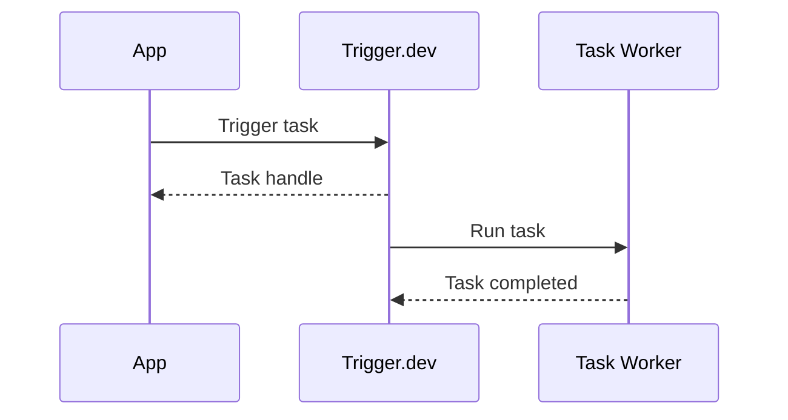
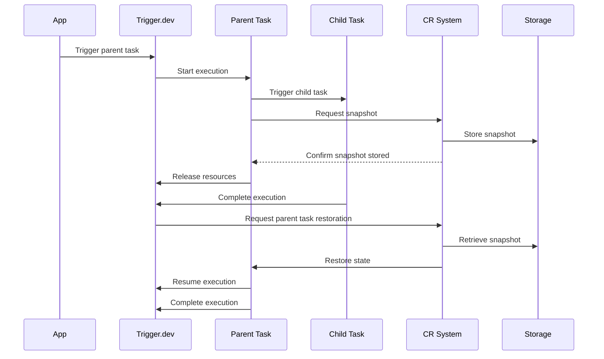
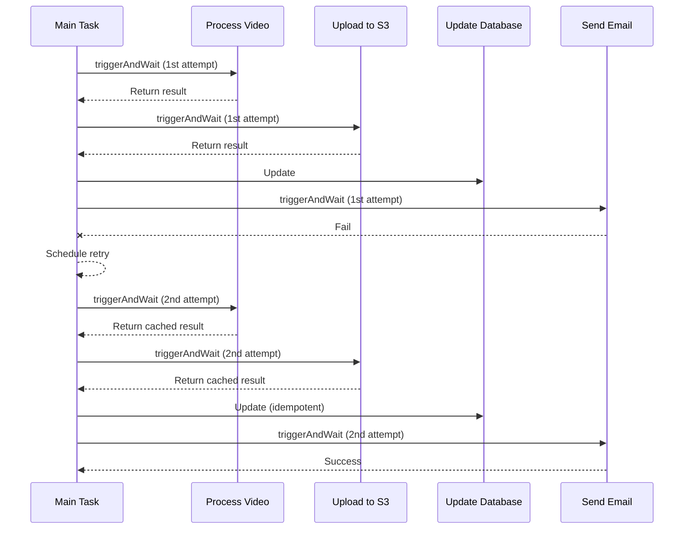

> Sources:
> - https://trigger.dev/docs/introduction
> - https://trigger.dev/docs/quick-start
> - https://trigger.dev/docs/manual-setup
> - https://trigger.dev/docs/how-it-works
> - https://trigger.dev/docs/video-walkthrough

# Getting Started

## Welcome to the Trigger.dev docs

Find all the resources and guides you need to get started

<CardGroup>
  <Card title="Quick start" href="/quick-start">
    Get started with Trigger.dev and run your first task in 3 minutes
  </Card>

  <Card title="Guides, frameworks & examples" href="/guides/introduction#example-tasks">
    Browse our wide range of guides, frameworks and example projects
  </Card>

  <Card title="Building with AI" href="/building-with-ai">
    Learn how to build Trigger.dev projects using AI coding assistants
  </Card>

  <Card title="Video walkthrough" href="/video-walkthrough">
    Watch an end-to-end demo of Trigger.dev in 10 minutes
  </Card>
</CardGroup>

## What is Trigger.dev?

Trigger.dev is an open source background jobs framework that lets you write reliable workflows in plain async code. Run long-running AI tasks, handle complex background jobs, and build AI agents with built-in queuing, automatic retries, and real-time monitoring. No timeouts, elastic scaling, and zero infrastructure management required.

We provide everything you need to build and manage background tasks: a CLI and SDK for writing tasks in your existing codebase, support for both [regular](/tasks/overview) and [scheduled](/tasks/scheduled) tasks, full observability through our dashboard, and a [Realtime API](/realtime) with [React hooks](/realtime/react-hooks#realtime-hooks) for showing task status in your frontend. You can use [Trigger.dev Cloud](https://cloud.trigger.dev) or [self-host](/self-hosting/overview) on your own infrastructure.

## Learn the concepts

<CardGroup>
  <Card title="Writing tasks" icon="wand-magic-sparkles" href="/tasks/overview">
    Tasks are the core of Trigger.dev. Learn what they are and how to write them.
  </Card>

  <Card title="Triggering tasks" icon="bullseye-pointer" href="/triggering">
    Learn how to trigger tasks from your codebase.
  </Card>

  <Card title="Runs" icon="person-running" href="/runs">
    Runs are the instances of tasks that are executed. Learn how they work.
  </Card>

  <Card title="API keys" icon="key" href="/apikeys">
    API keys are used to authenticate requests to the Trigger.dev API. Learn how to create and use
    them.
  </Card>
</CardGroup>

## Explore by feature

<CardGroup>
  <Card title="Scheduled tasks (cron)" icon="clock" href="/tasks/scheduled">
    Scheduled tasks are a type of task that is scheduled to run at a specific time.
  </Card>

  <Card title="Realtime API" icon="loader" href="/realtime">
    The Realtime API allows you to trigger tasks and get the status of runs.
  </Card>

  <Card title="React hooks" icon="react" href="/realtime/react-hooks">
    React hooks are a way to show task status in your frontend.
  </Card>

  <Card title="Waits" icon="calendar-clock" href="/wait">
    Waits are a way to wait for a task to finish before continuing.
  </Card>

  <Card title="Errors and retries" icon="message-exclamation" href="/errors-retrying">
    Learn how to handle errors and retries.
  </Card>

  <Card title="Concurrency & Queues" icon="line-height" href="/queue-concurrency">
    Configure what you want to happen when there is more than one run at a time.
  </Card>

  <Card title="Wait for token (human-in-the-loop)" icon="hand" href="/wait-for-token">
    Pause runs until a token is completed via an approval workflow.
  </Card>

  <Card title="Build extensions" icon="gear" href="/config/extensions/overview">
    Customize the build process or the resulting bundle and container image.
  </Card>
</CardGroup>

## Explore by build extension

| Extension             | What it does                                                 | Docs                                                   |
| :-------------------- | :----------------------------------------------------------- | :----------------------------------------------------- |
| prismaExtension       | Use Prisma with Trigger.dev                                  | [Learn more](/config/extensions/prismaExtension)       |
| pythonExtension       | Execute Python scripts in Trigger.dev                        | [Learn more](/config/extensions/pythonExtension)       |
| playwright            | Use Playwright with Trigger.dev                              | [Learn more](/config/extensions/playwright)            |
| puppeteer             | Use Puppeteer with Trigger.dev                               | [Learn more](/config/extensions/puppeteer)             |
| lightpanda            | Use Lightpanda with Trigger.dev                              | [Learn more](/config/extensions/lightpanda)            |
| ffmpeg                | Use FFmpeg with Trigger.dev                                  | [Learn more](/config/extensions/ffmpeg)                |
| aptGet                | Install system packages with aptGet                          | [Learn more](/config/extensions/aptGet)                |
| additionalFiles       | Copy additional files to the build directory                 | [Learn more](/config/extensions/additionalFiles)       |
| additionalPackages    | Include additional packages in the build                     | [Learn more](/config/extensions/additionalPackages)    |
| syncEnvVars           | Automatically sync environment variables to Trigger.dev      | [Learn more](/config/extensions/syncEnvVars)           |
| esbuildPlugin         | Add existing or custom esbuild plugins to your build process | [Learn more](/config/extensions/esbuildPlugin)         |
| emitDecoratorMetadata | Support for the emitDecoratorMetadata TypeScript compiler    | [Learn more](/config/extensions/emitDecoratorMetadata) |
| audioWaveform         | Support for Audio Waveform in your project                   | [Learn more](/config/extensions/audioWaveform)         |

## Explore by example

<CardGroup>
  <Card title="FFmpeg" href="/guides/examples/ffmpeg-video-processing" />

  <Card title="Fal.ai" href="/guides/examples/fal-ai-image-to-cartoon" />

  <Card title="Puppeteer" href="/guides/examples/puppeteer" />

  <Card title="LibreOffice" href="/guides/examples/libreoffice-pdf-conversion" />

  <Card title="OpenAI" href="/guides/examples/open-ai-with-retrying" />

  <Card title="Browserbase" href="/guides/examples/scrape-hacker-news" />

  <Card title="Sentry" href="/guides/examples/sentry-error-tracking" />

  <Card title="Resend" href="/guides/examples/resend-email-sequence" />

  <Card title="Vercel AI SDK" href="/guides/examples/vercel-ai-sdk" />

  <Card title="Sharp" href="/guides/examples/sharp-image-processing" />

  <Card title="Deepgram" href="/guides/examples/deepgram-transcribe-audio" />

  <Card title="Supabase" href="/guides/examples/supabase-database-operations" />

  <Card title="DALL•E" href="/guides/examples/dall-e3-generate-image" />

  <Card title="Firecrawl" href="/guides/examples/firecrawl-url-crawl" />

  <Card title="Lightpanda" href="/guides/examples/lightpanda" />
</CardGroup>

## Getting help

We'd love to hear from you or give you a hand getting started. Here are some ways to get in touch with us.

<CardGroup>
  <Card title="Join our Discord server" icon="discord" href="https://discord.gg/kA47vcd8P6">
    Our Discord is the best place to get help with any questions about Trigger.dev.
  </Card>

  <Card
    title="Follow us on X (Twitter)"
    icon={
  <svg xmlns="http://www.w3.org/2000/svg" height="20" viewBox="0 0 512 512">
    <path d="M389.2 48h70.6L305.6 224.2 487 464H345L233.7 318.6 106.5 464H35.8L200.7 275.5 26.8 48H172.4L272.9 180.9 389.2 48zM364.4 421.8h39.1L151.1 88h-42L364.4 421.8z" />
  </svg>
}
    href="https://twitter.com/triggerdotdev"
  >
    Follow us to get the latest updates and news.
  </Card>

  <Card title="Schedule a call" icon="phone" href="https://cal.com/team/triggerdotdev/founders-call">
    Arrange a call with one of the founders to get help with any questions.
  </Card>

  <Card title="Give us a star on GitHub" icon="star" href="https://github.com/triggerdotdev/trigger.dev">
    Check us out our GitHub repo and give us a star if you like what we're doing.
  </Card>
</CardGroup>

---

## Quick start: add Trigger.dev to your project

Set up Trigger.dev in your existing project in under 3 minutes. Install the SDK, create your first background task, and trigger it from your code.

## Set up with AI

Using an AI coding assistant? Copy this prompt and paste it into Claude Code, Cursor, Copilot, Windsurf, or any AI tool. It'll handle the setup for you.

<Accordion title="Copy the setup prompt">
  ```text theme={"theme":"css-variables"}
  Help me add Trigger.dev to this project.

  ## What to do

  1. I need a Trigger.dev account. If I don't have one, point me to https://cloud.trigger.dev to sign up. Wait for me to confirm.
  2. Run `npx trigger.dev@latest init` in the project root.
     - When it asks about the MCP server, recommend I install it (best DX: gives you direct access to Trigger.dev docs, deploys, and run monitoring).
     - Install the "Hello World" example task when prompted.
  3. Run `npx trigger.dev@latest dev` to start the dev server.
  4. Once the dev server is running, test the example task from the Trigger.dev dashboard.
  5. Set TRIGGER_SECRET_KEY in my .env file (or .env.local for Next.js). I can find it on the API Keys page in the dashboard.
  6. Ask me what framework I'm using and show me how to trigger the task from my backend code.

  If I've already run init and want the MCP server, run: npx trigger.dev@latest install-mcp

  ## Critical rules

  - ALWAYS import from `@trigger.dev/sdk`. NEVER import from `@trigger.dev/sdk/v3`.
  - NEVER use `client.defineJob()` — that's the deprecated v2 API.
  - Use type-only imports when triggering from backend code to avoid bundling task code:

    import type { myTask } from "./trigger/example";
    import { tasks } from "@trigger.dev/sdk";

    const handle = await tasks.trigger<typeof myTask>("hello-world", { message: "Hello from my app!" });

  ## When done, point me to

  - Writing tasks: https://trigger.dev/docs/tasks/overview
  - Real-time updates: https://trigger.dev/docs/realtime/overview
  - AI tooling: https://trigger.dev/docs/building-with-ai
  ```
</Accordion>

## Manual setup

<Steps>
  <Step title="Create a Trigger.dev account">
    Sign up at [Trigger.dev Cloud](https://cloud.trigger.dev) (or [self-host](/open-source-self-hosting)). The onboarding flow will guide you through creating your first organization and project.
  </Step>

  <Step title="Run the CLI `init` command">
    The easiest way to get started is to use the CLI. It will add Trigger.dev to your existing project, create a `/trigger` folder and give you an example task.

    Run this command in the root of your project to get started:

    <CodeGroup>
      ```bash npm theme={"theme":"css-variables"} theme={"theme":"css-variables"} theme={"theme":"css-variables"} theme={"theme":"css-variables"} theme={"theme":"css-variables"} theme={"theme":"css-variables"} theme={"theme":"css-variables"} theme={"theme":"css-variables"} theme={"theme":"css-variables"} theme={"theme":"css-variables"}
      npx trigger.dev@latest init
      ```

      ```bash pnpm theme={"theme":"css-variables"} theme={"theme":"css-variables"} theme={"theme":"css-variables"} theme={"theme":"css-variables"} theme={"theme":"css-variables"} theme={"theme":"css-variables"} theme={"theme":"css-variables"} theme={"theme":"css-variables"} theme={"theme":"css-variables"} theme={"theme":"css-variables"}
      pnpm dlx trigger.dev@latest init
      ```

      ```bash yarn theme={"theme":"css-variables"} theme={"theme":"css-variables"} theme={"theme":"css-variables"} theme={"theme":"css-variables"} theme={"theme":"css-variables"} theme={"theme":"css-variables"} theme={"theme":"css-variables"} theme={"theme":"css-variables"} theme={"theme":"css-variables"} theme={"theme":"css-variables"}
      yarn dlx trigger.dev@latest init
      ```
    </CodeGroup>

    It will do a few things:

    <Tip title="MCP Server">
      Our [Trigger.dev MCP server](/mcp-introduction) gives your AI assistant direct access to Trigger.dev tools; search docs, trigger tasks, deploy projects, and monitor runs. We recommend installing it for the best developer experience.
    </Tip>

    1. Ask if you want to install the [Trigger.dev MCP server](/mcp-introduction) for your AI assistant.
    2. Log you into the CLI if you're not already logged in.
    3. Ask you to select your project.
    4. Install the required SDK packages.
    5. Ask where you'd like to create the `/trigger` directory and create it with an example task.
    6. Create a `trigger.config.ts` file in the root of your project.

    Install the "Hello World" example task when prompted. We'll use this task to test the setup.
  </Step>

  <Step title="Run the CLI `dev` command">
    The CLI `dev` command runs a server for your tasks. It watches for changes in your `/trigger` directory and communicates with the Trigger.dev platform to register your tasks, perform runs, and send data back and forth.

    It can also update your `@trigger.dev/*` packages to prevent version mismatches and failed deploys. You will always be prompted first.

    <CodeGroup>
      ```bash npm theme={"theme":"css-variables"} theme={"theme":"css-variables"} theme={"theme":"css-variables"} theme={"theme":"css-variables"} theme={"theme":"css-variables"} theme={"theme":"css-variables"} theme={"theme":"css-variables"} theme={"theme":"css-variables"} theme={"theme":"css-variables"} theme={"theme":"css-variables"}
      npx trigger.dev@latest dev
      ```

      ```bash pnpm theme={"theme":"css-variables"} theme={"theme":"css-variables"} theme={"theme":"css-variables"} theme={"theme":"css-variables"} theme={"theme":"css-variables"} theme={"theme":"css-variables"} theme={"theme":"css-variables"} theme={"theme":"css-variables"} theme={"theme":"css-variables"} theme={"theme":"css-variables"}
      pnpm dlx trigger.dev@latest dev
      ```

      ```bash yarn theme={"theme":"css-variables"} theme={"theme":"css-variables"} theme={"theme":"css-variables"} theme={"theme":"css-variables"} theme={"theme":"css-variables"} theme={"theme":"css-variables"} theme={"theme":"css-variables"} theme={"theme":"css-variables"} theme={"theme":"css-variables"} theme={"theme":"css-variables"}
      yarn dlx trigger.dev@latest dev
      ```
    </CodeGroup>
  </Step>

  <Step title="Perform a test run using the dashboard">
    The CLI `dev` command spits out various useful URLs. Right now we want to visit the Test page.

    You should see our Example task in the list <Icon icon="circle-1" />, select it. Most tasks have a "payload" which you enter in the JSON editor <Icon icon="circle-2" />, but our example task doesn't need any input.

    You can configure options on the run <Icon icon="circle-3" />, view recent payloads <Icon icon="circle-4" />, and create run templates <Icon icon="circle-5" />.

    Press the "Run test" button <Icon icon="circle-6" />.

    
  </Step>

  <Step title="View your run">
    Congratulations, you should see the run page which will live reload showing you the current state of the run.

    

    If you go back to your terminal you'll see that the dev command also shows the task status and links to the run log.

    
  </Step>
</Steps>

## Triggering tasks from your app

The test page in the dashboard is great for verifying your task works. To trigger tasks from your own code, you'll need to set the `TRIGGER_SECRET_KEY` environment variable. Grab it from the API Keys page in the dashboard and add it to your `.env` file.

```bash .env theme={"theme":"css-variables"}
TRIGGER_SECRET_KEY=tr_dev_...
```

See [Triggering](/triggering) for the full guide, or jump straight to framework-specific setup for [Next.js](/guides/frameworks/nextjs), [Remix](/guides/frameworks/remix), or [Node.js](/guides/frameworks/nodejs).

## Next steps

<CardGroup>
  <Card title="Building with AI" icon="brain" href="/building-with-ai">
    Build Trigger.dev projects using AI coding assistants
  </Card>

  <Card title="How to trigger your tasks" icon="bolt" href="/triggering">
    Trigger tasks from your backend code
  </Card>

  <Card title="Writing tasks" icon="wand-magic-sparkles" href="/tasks/overview">
    Task options, lifecycle hooks, retries, and queues
  </Card>

  <Card title="Guides and example projects" icon="books" href="/guides/introduction">
    Framework guides and working example repos
  </Card>
</CardGroup>

---

## Manual setup

How to manually setup Trigger.dev in your project.

This guide covers how to manually set up Trigger.dev in your project, including configuration for different package managers, monorepos, and build extensions. This guide replicates all the steps performed by the `trigger.dev init` command. Follow our [Quickstart](/quick-start) for a more streamlined setup.

## Prerequisites

* Node.js 18.20+ (or Bun runtime)
* A Trigger.dev account (sign up at [trigger.dev](https://trigger.dev))
* TypeScript 5.0.4 or later (for TypeScript projects)

## CLI Authentication

Before setting up your project, you need to authenticate the CLI with Trigger.dev:

```bash theme={"theme":"css-variables"}
# Login to Trigger.dev
npx trigger.dev@latest login

# Or with a specific API URL (for self-hosted instances)
npx trigger.dev@latest login --api-url https://your-trigger-instance.com
```

This will open your browser to authenticate. Once authenticated, you'll need to select or create a project in the Trigger.dev dashboard to get your project reference (e.g., `proj_abc123`).

## Package installation

Install the required packages based on your package manager:

<CodeGroup>
  ```bash npm theme={"theme":"css-variables"}
  npm add @trigger.dev/sdk@latest
  npm add --save-dev @trigger.dev/build@latest
  ```

  ```bash pnpm theme={"theme":"css-variables"}
  pnpm add @trigger.dev/sdk@latest
  pnpm add -D @trigger.dev/build@latest
  ```

  ```bash yarn theme={"theme":"css-variables"}
  yarn add @trigger.dev/sdk@latest
  yarn add -D @trigger.dev/build@latest
  ```

  ```bash bun theme={"theme":"css-variables"}
  bun add @trigger.dev/sdk@latest
  bun add -D @trigger.dev/build@latest
  ```
</CodeGroup>

## Environment variables

For local development, you need to set up the `TRIGGER_SECRET_KEY` environment variable. This key authenticates your application with Trigger.dev.

1. Go to your project dashboard in Trigger.dev
2. Navigate to the "API Keys" page
3. Copy the **DEV** secret key
4. Add it to your local environment file:

```bash theme={"theme":"css-variables"}
TRIGGER_SECRET_KEY=tr_dev_xxxxxxxxxx
```

### Self-hosted instances

If you're using a self-hosted Trigger.dev instance, also set:

```bash theme={"theme":"css-variables"}
TRIGGER_API_URL=https://your-trigger-instance.com
```

## CLI setup

You can run the Trigger.dev CLI in two ways:

### Option 1: Using npx/pnpm dlx/yarn dlx

```bash theme={"theme":"css-variables"}
# npm
npx trigger.dev@latest dev

# pnpm
pnpm dlx trigger.dev@latest dev

# yarn
yarn dlx trigger.dev@latest dev
```

### Option 2: Add as dev dependency

Add the CLI to your `package.json`:

```json theme={"theme":"css-variables"}
{
  "devDependencies": {
    "trigger.dev": "^4.0.0"
  }
}
```

Then add scripts to your `package.json`:

```json theme={"theme":"css-variables"}
{
  "scripts": {
    "dev:trigger": "trigger dev",
    "deploy:trigger": "trigger deploy"
  }
}
```

### Version pinning

Make sure to pin the version of the CLI to the same version as the SDK that you are using:

```json theme={"theme":"css-variables"}
"devDependencies": {
  "trigger.dev": "^4.0.0",
  "@trigger.dev/build": "^4.0.0"
},
"dependencies": {
  "@trigger.dev/sdk": "^4.0.0"
}
```

While running the CLI `dev` or `deploy` commands, the CLI will automatically detect mismatched versions and warn you.

## Configuration file

Create a `trigger.config.ts` file in your project root (or `trigger.config.mjs` for JavaScript projects):

```typescript theme={"theme":"css-variables"}
import { defineConfig } from "@trigger.dev/sdk";

export default defineConfig({
  // Your project ref from the Trigger.dev dashboard
  project: "<your-project-ref>", // e.g., "proj_abc123"

  // Directories containing your tasks
  dirs: ["./src/trigger"], // Customize based on your project structure

  // Retry configuration
  retries: {
    enabledInDev: false, // Enable retries in development
    default: {
      maxAttempts: 3,
      minTimeoutInMs: 1000,
      maxTimeoutInMs: 10000,
      factor: 2,
      randomize: true,
    },
  },

  // Build configuration (optional)
  build: {
    extensions: [], // Build extensions go here
  },

  // Max duration of a task in seconds
  maxDuration: 3600,
});
```

### Using the Bun runtime

By default, Trigger.dev will use the Node.js runtime. If you're using Bun, you can specify the runtime:

```typescript theme={"theme":"css-variables"}
import { defineConfig } from "@trigger.dev/sdk";

export default defineConfig({
  project: "<your-project-ref>",
  runtime: "bun",
  dirs: ["./src/trigger"],
});
```

See our [Bun runtime documentation](/guides/frameworks/bun) for more information.

## Add your first task

Create a `trigger` directory (matching the `dirs` in your config) and add an example task:

```typescript src/trigger/example.ts theme={"theme":"css-variables"}
import { task } from "@trigger.dev/sdk";

export const helloWorld = task({
  id: "hello-world",
  run: async (payload: { name: string }) => {
    console.log(`Hello ${payload.name}!`);

    return {
      message: `Hello ${payload.name}!`,
      timestamp: new Date().toISOString(),
    };
  },
});
```

See our [Tasks](/tasks/overview) docs for more information on how to create tasks.

## TypeScript config

If you're using TypeScript, add `trigger.config.ts` to your `tsconfig.json` include array:

```json theme={"theme":"css-variables"}
{
  "compilerOptions": {
    // ... your existing options
  },
  "include": [
    // ... your existing includes
    "trigger.config.ts"
  ]
}
```

## Git config

Add `.trigger` to your `.gitignore` file to exclude Trigger.dev's local development files:

```bash theme={"theme":"css-variables"}
# Trigger.dev
.trigger
```

If you don't have a `.gitignore` file, create one with this content.

## React hooks setup

If you're building a React frontend application and want to display task status in real-time, install the React hooks package:

### Installation

```bash theme={"theme":"css-variables"}
# npm
npm install @trigger.dev/react-hooks@latest

# pnpm
pnpm add @trigger.dev/react-hooks@latest

# yarn
yarn add @trigger.dev/react-hooks@latest

# bun
bun add @trigger.dev/react-hooks@latest
```

### Basic usage

1. **Generate a Public Access Token** in your backend:

```typescript theme={"theme":"css-variables"}
import { auth } from "@trigger.dev/sdk";

// In your backend API
export async function getPublicAccessToken() {
  const publicAccessToken = await auth.createPublicToken({
    scopes: ["read:runs"], // Customize based on needs
  });

  return publicAccessToken;
}
```

2. **Use hooks to monitor tasks**:

```tsx theme={"theme":"css-variables"}
import { useRealtimeRun } from "@trigger.dev/react-hooks";

export function TaskStatus({
  runId,
  publicAccessToken,
}: {
  runId: string;
  publicAccessToken: string;
}) {
  const { run, error } = useRealtimeRun(runId, {
    accessToken: publicAccessToken,
  });

  if (error) return <div>Error: {error.message}</div>;
  if (!run) return <div>Loading...</div>;

  return (
    <div>
      <p>Status: {run.status}</p>
      <p>Progress: {run.completedAt ? "Complete" : "Running..."}</p>
    </div>
  );
}
```

For more information, see the [React Hooks documentation](/realtime/react-hooks/overview).

## Build extensions

Build extensions allow you to customize the build process. Ensure you have the `@trigger.dev/build` package installed in your project (see [package installation](#package-installation)).

Now you can use any of the built-in extensions:

```typescript theme={"theme":"css-variables"}
import { defineConfig } from "@trigger.dev/sdk";
import { prismaExtension } from "@trigger.dev/build/extensions/prisma";

export default defineConfig({
  project: "<project-ref>",
  build: {
    extensions: [
      prismaExtension({
        mode: "legacy",
        schema: "prisma/schema.prisma",
        migrate: true, // Run migrations on deploy
      }),
    ],
  },
});
```

See our [Build extensions](/config/extensions/overview) docs for more information on how to use build extensions and the available extensions.

## Monorepo setup

There are two main approaches for setting up Trigger.dev in a monorepo:

1. **Tasks as a package**: Create a separate package for your Trigger.dev tasks that can be shared across apps
2. **Tasks in apps**: Install Trigger.dev directly in individual apps that need background tasks

Both approaches work well depending on your needs. Use the tasks package approach if you want to share tasks across multiple applications, or the app-based approach if tasks are specific to individual apps.

### Approach 1: Tasks as a package (Turborepo)

This approach creates a dedicated tasks package that can be consumed by multiple apps in your monorepo.

#### 1. Set up workspace configuration

**Root `package.json`**:

```json theme={"theme":"css-variables"}
{
  "name": "my-monorepo",
  "private": true,
  "scripts": {
    "build": "turbo run build",
    "dev": "turbo run dev",
    "lint": "turbo run lint"
  },
  "devDependencies": {
    "turbo": "^2.4.4",
    "typescript": "5.8.2"
  },
  "packageManager": "pnpm@9.0.0"
}
```

**`pnpm-workspace.yaml`**:

```yaml theme={"theme":"css-variables"}
packages:
  - "apps/*"
  - "packages/*"
```

**`turbo.json`**:

```json theme={"theme":"css-variables"}
{
  "$schema": "https://turbo.build/schema.json",
  "ui": "tui",
  "tasks": {
    "build": {
      "dependsOn": ["^build"],
      "outputs": [".next/**", "!.next/cache/**"]
    },
    "dev": {
      "cache": false,
      "persistent": true
    },
    "lint": {
      "dependsOn": ["^lint"]
    }
  }
}
```

#### 2. Create the tasks package

**`packages/tasks/package.json`**:

```json theme={"theme":"css-variables"}
{
  "name": "@repo/tasks",
  "version": "0.0.0",
  "dependencies": {
    "@trigger.dev/sdk": "^4.0.0"
  },
  "devDependencies": {
    "@trigger.dev/build": "^4.0.0"
  },
  "exports": {
    ".": "./src/trigger/index.ts",
    "./trigger": "./src/index.ts"
  }
}
```

**`packages/tasks/trigger.config.ts`**:

```typescript theme={"theme":"css-variables"}
import { defineConfig } from "@trigger.dev/sdk";

export default defineConfig({
  project: "<your-project-ref>", // Replace with your project reference
  dirs: ["./src/trigger"],
  retries: {
    enabledInDev: true,
    default: {
      maxAttempts: 3,
      minTimeoutInMs: 1000,
      maxTimeoutInMs: 10000,
      factor: 2,
      randomize: true,
    },
  },
  maxDuration: 3600,
});
```

**`packages/tasks/src/index.ts`**:

```typescript theme={"theme":"css-variables"}
export * from "@trigger.dev/sdk"; // Export values and types from the Trigger.dev sdk
```

**`packages/tasks/src/trigger/index.ts`**:

```typescript theme={"theme":"css-variables"}
// Export tasks
export * from "./example";
```

**`packages/tasks/src/trigger/example.ts`**:

```typescript theme={"theme":"css-variables"}
import { task } from "@trigger.dev/sdk";

export const helloWorld = task({
  id: "hello-world",
  run: async (payload: { name: string }) => {
    console.log(`Hello ${payload.name}!`);

    return {
      message: `Hello ${payload.name}!`,
      timestamp: new Date().toISOString(),
    };
  },
});
```

See our [turborepo-prisma-tasks-package example](https://github.com/triggerdotdev/examples/tree/main/monorepos/turborepo-prisma-tasks-package) for a more complete example.

#### 3. Use tasks in your apps

**`apps/web/package.json`**:

```json theme={"theme":"css-variables"}
{
  "name": "web",
  "dependencies": {
    "@repo/tasks": "workspace:*",
    "next": "^15.2.1",
    "react": "^19.0.0",
    "react-dom": "^19.0.0"
  }
}
```

**`apps/web/app/api/actions.ts`**:

```typescript theme={"theme":"css-variables"}
"use server";

import { tasks } from "@repo/tasks/trigger";
import type { helloWorld } from "@repo/tasks";
//     👆 type only import

export async function triggerHelloWorld(name: string) {
  try {
    const handle = await tasks.trigger<typeof helloWorld>("hello-world", {
      name: name,
    });

    return handle.id;
  } catch (error) {
    console.error(error);
    return { error: "something went wrong" };
  }
}
```

#### 4. Development workflow

Run the development server for the tasks package:

```bash theme={"theme":"css-variables"}
# From the root of your monorepo
cd packages/tasks
npx trigger.dev@latest dev

# Or using turbo (if you add dev:trigger script to tasks package.json)
turbo run dev:trigger --filter=@repo/tasks
```

### Approach 2: Tasks in apps (Turborepo)

This approach installs Trigger.dev directly in individual apps that need background tasks.

#### 1. Install in your app

**`apps/web/package.json`**:

```json theme={"theme":"css-variables"}
{
  "name": "web",
  "dependencies": {
    "@trigger.dev/sdk": "^4.0.0",
    "next": "^15.2.1",
    "react": "^19.0.0",
    "react-dom": "^19.0.0"
  },
  "devDependencies": {
    "@trigger.dev/build": "^4.0.0"
  }
}
```

#### 2. Add configuration

**`apps/web/trigger.config.ts`**:

```typescript theme={"theme":"css-variables"}
import { defineConfig } from "@trigger.dev/sdk";

export default defineConfig({
  project: "<your-project-ref>", // Replace with your project reference
  dirs: ["./src/trigger"],
  retries: {
    enabledInDev: true,
    default: {
      maxAttempts: 3,
      minTimeoutInMs: 1000,
      maxTimeoutInMs: 10000,
      factor: 2,
      randomize: true,
    },
  },
  maxDuration: 3600,
});
```

#### 3. Create tasks

**`apps/web/src/trigger/example.ts`**:

```typescript theme={"theme":"css-variables"}
import { task } from "@trigger.dev/sdk";

export const helloWorld = task({
  id: "hello-world",
  run: async (payload: { name: string }) => {
    console.log(`Hello ${payload.name}!`);

    return {
      message: `Hello ${payload.name}!`,
      timestamp: new Date().toISOString(),
    };
  },
});
```

#### 4. Use tasks in your app

**`apps/web/app/api/actions.ts`**:

```typescript theme={"theme":"css-variables"}
"use server";

import { tasks } from "@trigger.dev/sdk";
import type { helloWorld } from "../../src/trigger/example";
//     👆 type only import

export async function triggerHelloWorld(name: string) {
  try {
    const handle = await tasks.trigger<typeof helloWorld>("hello-world", {
      name: name,
    });

    return handle.id;
  } catch (error) {
    console.error(error);
    return { error: "something went wrong" };
  }
}
```

#### 5. Development workflow

```bash theme={"theme":"css-variables"}
# From the app directory
cd apps/web
npx trigger.dev@latest dev

# Or from the root using turbo
turbo run dev:trigger --filter=web
```

## Example projects

You can find a growing list of example projects in our [examples](/guides/introduction) section.

## Troubleshooting

If you run into any issues, please check our [Troubleshooting](/troubleshooting) page.

## Feedback

If you have any feedback, please let us know by [opening an issue](https://github.com/triggerdotdev/trigger.dev/issues).

---

## How it works

Understand how Trigger.dev works and how it can help you.

## Introduction

Trigger.dev v3 allows you to integrate long-running async tasks into your application and run them in the background. This allows you to offload tasks that take a long time to complete, such as sending multi-day email campaigns, processing videos, or running long chains of AI tasks.

For example, the below task processes a video with `ffmpeg` and sends the results to an s3 bucket, then updates a database with the results and sends an email to the user.

```ts /trigger/video.ts theme={"theme":"css-variables"}
import { logger, task } from "@trigger.dev/sdk";
import { updateVideoUrl } from "../db.js";
import ffmpeg from "fluent-ffmpeg";
import { Readable } from "node:stream";
import type { ReadableStream } from "node:stream/web";
import * as fs from "node:fs/promises";
import * as path from "node:path";
import { S3Client, PutObjectCommand } from "@aws-sdk/client-s3";
import { sendEmail } from "../email.js";
import { getVideo } from "../db.js";

// Initialize S3 client
const s3Client = new S3Client({
  region: process.env.AWS_REGION,
});

export const convertVideo = task({
  id: "convert-video",
  retry: {
    maxAttempts: 5,
    minTimeoutInMs: 1000,
    maxTimeoutInMs: 10000,
    factor: 2,
  },
  run: async ({ videoId }: { videoId: string }) => {
    const { url, userId } = await getVideo(videoId);

    const outputPath = path.join("/tmp", `output_${videoId}.mp4`);

    const response = await fetch(url);

    await new Promise((resolve, reject) => {
      ffmpeg(Readable.fromWeb(response.body as ReadableStream))
        .videoFilters("scale=iw/2:ih/2")
        .output(outputPath)
        .on("end", resolve)
        .on("error", reject)
        .run();
    });

    const processedContent = await fs.readFile(outputPath);

    // Upload to S3
    const s3Key = `processed-videos/output_${videoId}.mp4`;

    const uploadParams = {
      Bucket: process.env.S3_BUCKET,
      Key: s3Key,
      Body: processedContent,
    };

    await s3Client.send(new PutObjectCommand(uploadParams));
    const s3Url = `https://${process.env.S3_BUCKET}.s3.amazonaws.com/${s3Key}`;

    logger.info("Video converted", { videoId, s3Url });

    // Update database
    await updateVideoUrl(videoId, s3Url);

    await sendEmail(
      userId,
      "Video Processing Complete",
      `Your video has been processed and is available at: ${s3Url}`
    );

    return { success: true, s3Url };
  },
});
```

Now in your application, you can trigger this task by calling:

```ts theme={"theme":"css-variables"}
import { NextResponse } from "next/server";
import { tasks } from "@trigger.dev/sdk";
import type { convertVideo } from "./trigger/video";
//     👆 **type-only** import

export async function POST(request: Request) {
  const body = await request.json();

  // Trigger the task, this will return before the task is completed
  const handle = await tasks.trigger<typeof convertVideo>("convert-video", body);

  return NextResponse.json(handle);
}
```

This will schedule the task to run in the background and return a handle that you can use to check the status of the task. This allows your backend application to respond quickly to the user and offload the long-running task to Trigger.dev.

## The CLI

Trigger.dev comes with a CLI that allows you to initialize Trigger.dev into your project, deploy your tasks, and run your tasks locally. You can run it via `npx` like so:

```sh theme={"theme":"css-variables"}
npx trigger.dev@latest login # Log in to your Trigger.dev account
npx trigger.dev@latest init # Initialize Trigger.dev in your project
npx trigger.dev@latest dev # Run your tasks locally
npx trigger.dev@latest deploy # Deploy your tasks to the Trigger.dev instance
```

All these commands work with the Trigger.dev cloud and/or your self-hosted instance. It supports multiple profiles so you can easily switch between different accounts or instances.

```sh theme={"theme":"css-variables"}
npx trigger.dev@latest login --profile <profile> -a https://trigger.example.com # Log in to a specific profile into a self-hosted instance
npx trigger.dev@latest dev --profile <profile> # Initialize Trigger.dev in your project
npx trigger.dev@latest deploy --profile <profile> # Deploy your tasks to the Trigger.dev instance
```

## Trigger.dev architecture

Trigger.dev implements a serverless architecture (without timeouts!) that allows you to run your tasks in a scalable and reliable way. When you run `npx trigger.dev@latest deploy`, we build and deploy your task code to your Trigger.dev instance. Then, when you trigger a task from your application, it's run in a secure, isolated environment with the resources you need to complete the task. A simplified diagram for a task execution looks like this:



In reality there are many more components involved, such as the task queue, the task scheduler, and the task worker pool, logging (etc.), but this diagram gives you a high-level overview of how Trigger.dev works.

## The Checkpoint-Resume System

Trigger.dev implements a powerful Checkpoint-Resume System that enables efficient execution of long-running background tasks in a serverless-like environment. This system allows tasks to pause, checkpoint their state, and resume seamlessly, optimizing resource usage and enabling complex workflows.

Here's how the Checkpoint-Resume System works:

1. **Task Execution**: When a task is triggered, it runs in an isolated environment with all necessary resources.

2. **Subtask Handling**: If a task needs to trigger a subtask, it can do so and wait for its completion using `triggerAndWait`

3. **State Checkpointing**: While waiting for a subtask or during a programmed pause (e.g., `wait.for({ seconds: 30 })`), the system uses CRIU (Checkpoint/Restore In Userspace) to create a checkpoint of the task's entire state, including memory, CPU registers, and open file descriptors.

4. **Resource Release**: After checkpointing, the parent task's resources are released, freeing up the execution environment.

5. **Efficient Storage**: The checkpoint is efficiently compressed and stored on disk, ready to be restored when needed.

6. **Event-Driven Resumption**: When a subtask completes or a wait period ends, Trigger.dev's event system triggers the restoration process.

7. **State Restoration**: The checkpoint is loaded back into a new execution environment, restoring the task to its exact state before suspension.

8. **Seamless Continuation**: The task resumes execution from where it left off, with any subtask results or updated state seamlessly integrated.

This approach allows Trigger.dev to manage resources efficiently, handle complex task dependencies, and provide a virtually limitless execution time for your tasks, all while maintaining the simplicity and scalability of a serverless architecture.

Example of a parent and child task using the Checkpoint-Resume System:

```ts theme={"theme":"css-variables"}
import { task, wait } from "@trigger.dev/sdk";

export const parentTask = task({
  id: "parent-task",
  run: async () => {
    console.log("Starting parent task");

    // This will cause the parent task to be checkpointed and suspended
    const result = await childTask.triggerAndWait({ data: "some data" });

    console.log("Child task result:", result);

    // This will also cause the task to be checkpointed and suspended
    await wait.for({ seconds: 30 });

    console.log("Resumed after 30 seconds");

    return "Parent task completed";
  },
});

export const childTask = task({
  id: "child-task",
  run: async (payload: { data: string }) => {
    console.log("Starting child task with data:", payload.data);

    // Simulate some work
    await sleep(5);

    return "Child task result";
  },
});
```

The diagram below illustrates the flow of the parent and child tasks using the Checkpoint-Resume System:



<Note>
  This is why, in the Trigger.dev Cloud, we don't charge for the time waiting for subtasks or the
  time spent in a paused state.
</Note>

## Durable execution

Trigger.dev's Checkpoint-Resume System, combined with idempotency keys, enables durable execution of complex workflows. This approach allows for efficient retries and caching of results, ensuring that work is not unnecessarily repeated in case of failures.

### How it works

1. **Task breakdown**: Complex workflows are broken down into smaller, independent subtasks.
2. **Idempotency keys**: Each subtask is assigned a unique idempotency key.
3. **Result caching**: The output of each subtask is cached based on its idempotency key.
4. **Intelligent retries**: If a failure occurs, only the failed subtask and subsequent tasks are retried.

### Example: Video processing workflow

Let's rewrite the `convert-video` task above to be more durable:

<CodeGroup>
  ```ts /trigger/video.ts theme={"theme":"css-variables"}
  import { idempotencyKeys, logger, task } from "@trigger.dev/sdk";
  import { processVideo, sendUserEmail, uploadToS3 } from "./tasks.js";
  import { updateVideoUrl } from "../db.js";

  export const convertVideo = task({
    id: "convert-video",
    retry: {
      maxAttempts: 5,
      minTimeoutInMs: 1000,
      maxTimeoutInMs: 10000,
      factor: 2,
    },
    run: async ({ videoId }: { videoId: string }) => {
      // Automatically scope the idempotency key to this run, across retries
      const idempotencyKey = await idempotencyKeys.create(videoId);

      // Process video
      const { processedContent } = await processVideo
        .triggerAndWait({ videoId }, { idempotencyKey })
        .unwrap(); // Calling unwrap will return the output of the subtask, or throw an error if the subtask failed

      // Upload to S3
      const { s3Url } = await uploadToS3
        .triggerAndWait({ processedContent, videoId }, { idempotencyKey })
        .unwrap();

      // Update database
      await updateVideoUrl(videoId, s3Url);

      // Send email, we don't need to wait for this to finish
      await sendUserEmail.trigger({ videoId, s3Url }, { idempotencyKey });

      return { success: true, s3Url };
    },
  });
  ```

  ```ts /trigger/tasks.ts theme={"theme":"css-variables"}
  import { task, logger } from "@trigger.dev/sdk";
  import ffmpeg from "fluent-ffmpeg";
  import { Readable } from "node:stream";
  import type { ReadableStream } from "node:stream/web";
  import * as fs from "node:fs/promises";
  import * as path from "node:path";
  import { S3Client, PutObjectCommand } from "@aws-sdk/client-s3";
  import { sendEmail } from "../email.js";
  import { getVideo } from "../db.js";

  // Initialize S3 client
  const s3Client = new S3Client({
    region: process.env.AWS_REGION,
  });

  export const processVideo = task({
    id: "process-video",
    run: async ({ videoId }: { videoId: string }) => {
      const { url } = await getVideo(videoId);

      const outputPath = path.join("/tmp", `output_${videoId}.mp4`);
      const response = await fetch(url);

      await logger.trace("ffmpeg", async (span) => {
        await new Promise((resolve, reject) => {
          ffmpeg(Readable.fromWeb(response.body as ReadableStream))
            .videoFilters("scale=iw/2:ih/2")
            .output(outputPath)
            .on("end", resolve)
            .on("error", reject)
            .run();
        });
      });

      const processedContent = await fs.readFile(outputPath);

      await fs.unlink(outputPath);

      return { processedContent: processedContent.toString("base64") };
    },
  });

  export const uploadToS3 = task({
    id: "upload-to-s3",
    run: async (payload: { processedContent: string; videoId: string }) => {
      const { processedContent, videoId } = payload;

      const s3Key = `processed-videos/output_${videoId}.mp4`;

      const uploadParams = {
        Bucket: process.env.S3_BUCKET,
        Key: s3Key,
        Body: Buffer.from(processedContent, "base64"),
      };

      await s3Client.send(new PutObjectCommand(uploadParams));
      const s3Url = `https://${process.env.S3_BUCKET}.s3.amazonaws.com/${s3Key}`;

      return { s3Url };
    },
  });

  export const sendUserEmail = task({
    id: "send-user-email",
    run: async ({ videoId, s3Url }: { videoId: string; s3Url: string }) => {
      const { userId } = await getVideo(videoId);

      return await sendEmail(
        userId,
        "Video Processing Complete",
        `Your video has been processed and is available at: ${s3Url}`
      );
    },
  });
  ```
</CodeGroup>

### How retries work

Let's say the email sending fails in our video processing workflow. Here's how the retry process works:

1. The main task throws an error and is scheduled for retry.
2. When retried, it starts from the beginning, but leverages cached results for completed subtasks.

Here's a sequence diagram illustrating this process:



## The build system

When you run `npx trigger.dev@latest deploy` or `npx trigger.dev@latest dev`, we build your task code using our build system, which is powered by [esbuild](https://esbuild.github.io/). When deploying, the code is packaged up into a Docker image and deployed to your Trigger.dev instance. When running in dev mode, the code is built and run locally on your machine. Some features of our build system include:

* **Bundled by default**: Code + dependencies are bundled and tree-shaked by default.
* **Build extensions**: Use and write custom build extensions to transform your code or the resulting docker image.
* **ESM ouput**: We output to ESM, which allows tree-shaking and better performance.

You can review the build output by running deploy with the `--dry-run` flag, which will output the Containerfile and the build output.

Learn more about working with our build system in the [configuration docs](/config/config-file).

## Dev mode

When you run `npx trigger.dev@latest dev`, we run your task code locally on your machine. All scheduling is still done in the Trigger.dev server instance, but the task code is run locally. This allows you to develop and test your tasks locally before deploying them to the cloud, and is especially useful for debugging and testing.

* The same build system is used in dev mode, so you can be sure that your code will run the same locally as it does in the cloud.
* Changes are automatically detected and a new version is spun up when you save your code.
* Add debuggers and breakpoints to your code and debug it locally.
* Each task is run in a separate process, so you can run multiple tasks in parallel.
* Auto-cancels tasks when you stop the dev server.

<Note>
  Trigger.dev currently does not support "offline" dev mode, where you can run tasks without an
  internet connection. [Please let us know](https://feedback.trigger.dev/) if this is a feature you
  want/need.
</Note>

## Staging and production environments

Trigger.dev supports deploying to `prod` and `staging` environments. This allows you to test your tasks in a staging environment before deploying them to production. You can deploy to a different environment by running `npx trigger.dev@latest deploy --env <env>`, where `<env>` is either `prod` or `staging`. Each environment has its own API Key, which you can use to trigger tasks in that environment.

For additional isolated environments, you can use [preview branches](/deployment/preview-branches), which allow you to create separate environments for each branch of your code.

## OpenTelemetry

The Trigger.dev logging and task dashboard is powered by OpenTelemetry traces and logs, which allows you to trace your tasks and auto-instrument your code. We also auto-correlate logs from subtasks and parent tasks, making it easy view the entire trace of a task execution. A single run of the video processing task above looks like this in the dashboard:


Because we use standard OpenTelemetry, you can instrument your code and OpenTelemetry compatible libraries to get detailed traces and logs of your tasks. The above trace instruments both Prisma and the AWS SDK:

```ts trigger.config.ts theme={"theme":"css-variables"}
import { defineConfig } from "@trigger.dev/sdk";
import { PrismaInstrumentation } from "@prisma/instrumentation";
import { AwsInstrumentation } from "@opentelemetry/instrumentation-aws-sdk";

export default defineConfig({
  project: "<your-project-ref>",
  instrumentations: [new PrismaInstrumentation(), new AwsInstrumentation()],
});
```

---

## Video walkthrough

Go from zero to a working task in your Next.js app in 10 minutes.

<iframe title="Trigger.dev walkthrough" />

### In this video we cover the following topics:

* [0:00](https://youtu.be/YH_4c0K7fGM?si=J8svVzotZtyTXDap\&t=0) – [Install Trigger.dev](/quick-start) in an existing Next.js project
* [1:44](https://youtu.be/YH_4c0K7fGM?si=J8svVzotZtyTXDap\&t=104) – [Run and test](/run-tests) the "Hello, world!" example project
* [2:09](https://youtu.be/YH_4c0K7fGM?si=FMTP8ep_cDBCU0_x\&t=128) – Create and run an AI image generation task that uses [Fal.ai](https://fal.ai) – ([View the code](/guides/examples/fal-ai-image-to-cartoon))
* [6:25](https://youtu.be/YH_4c0K7fGM?si=pPc8iLI2Y9FGD3yo\&t=385) – Create and run a [Realtime](/realtime/overview) example using [React hooks](/realtime/react-hooks) – ([View the code](/guides/examples/fal-ai-realtime))
* [11:10](https://youtu.be/YH_4c0K7fGM?si=Mjd0EvvNsNlVouvY\&t=670) – [Deploy your task](/cli-deploy) to the Trigger.dev Cloud

---
